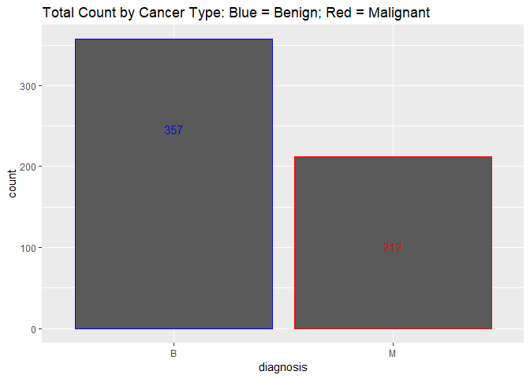
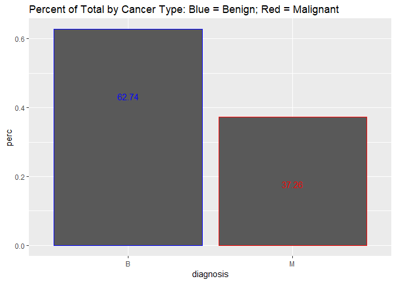
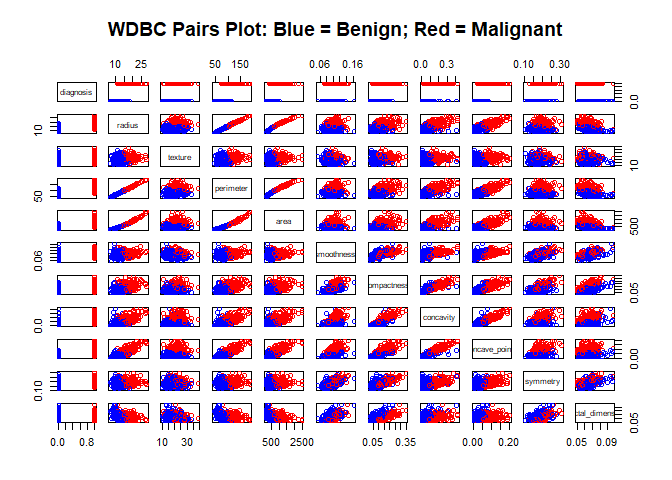
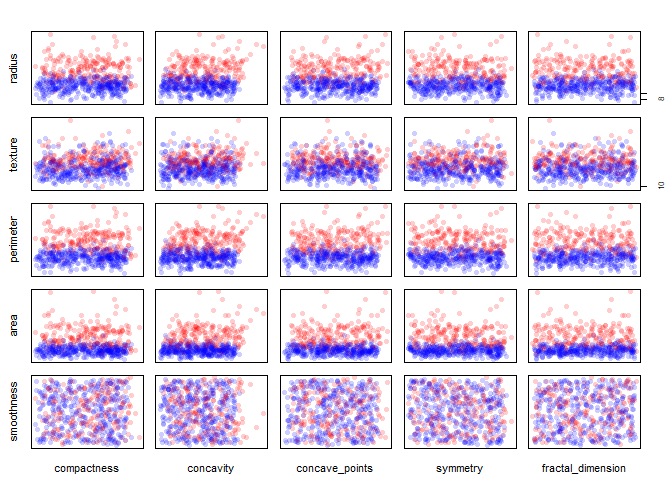
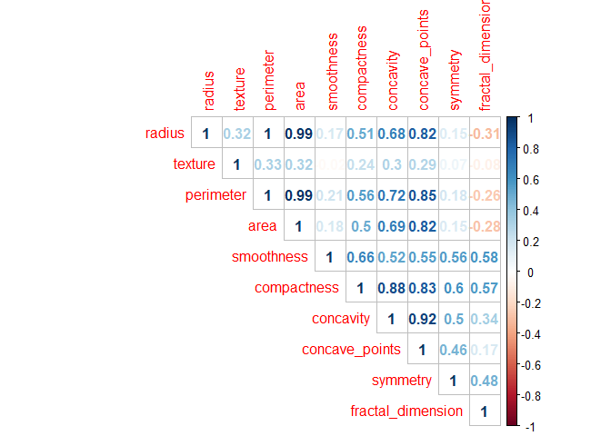
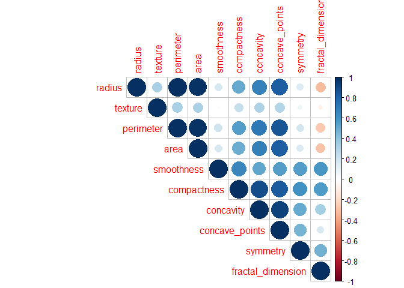
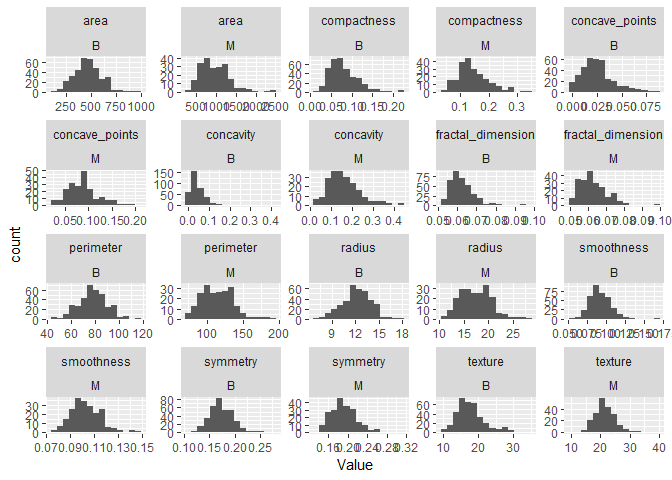
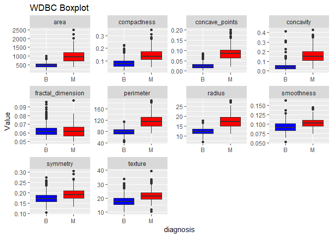
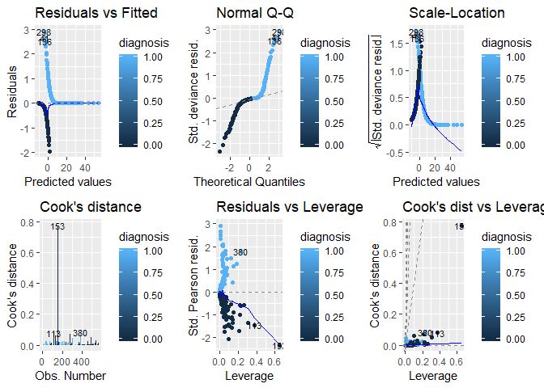

## Load Required Libraries
- Tidyverse 
- Amelia
- Corrplot
- PSCL
- ROCR
- MASS
- car
- ggfortify


## Load Data

- We are using the Breast Cancer Data from the Wisconsin Diagnostic Breast Cancer (WDBC) dataset and will first load it.


```r
wdbc_data <- read.csv("https://raw.githubusercontent.com/tikisen/6372_proj2/master/Data/wdbc.data.csv", 
                      sep = ",", 
                      row.names = NULL, 
                      header = TRUE,
                      na.strings = c(""),
                      stringsAsFactors = FALSE)

wdbc.data <- wdbc_data

wdbc.data <- wdbc.data %>% dplyr::select(ID_number = 1, everything())
wdbc.sub <- wdbc.data %>% dplyr::select(1:12)

wdbc_data <- wdbc_data %>% dplyr::select(ID_number = 1, everything())
wdbc_sub <- wdbc_data %>% dplyr::select(1:12)
wdbc_sub <- wdbc_sub %>% dplyr::mutate(dia = dplyr::case_when(diagnosis == "B" ~ 0,
                                                  diagnosis == "M" ~ 1)) %>%
 dplyr::select(1, 3:13) %>% dplyr::select(1, diagnosis = dia, 2:11)
```

# Bruce's Work Starts Here

## Check for missing values

```r
sapply(wdbc_data,function(x) sum(is.na(x)))
```

```
##               ID_number               diagnosis                  radius 
##                       0                       0                       0 
##                 texture               perimeter                    area 
##                       0                       0                       0 
##              smoothness             compactness               concavity 
##                       0                       0                       0 
##          concave_points                symmetry       fractal_dimension 
##                       0                       0                       0 
##               radius_SE              texture_SE            perimeter_SE 
##                       0                       0                       0 
##                 area_SE           smoothness_SE          compactness_SE 
##                       0                       0                       0 
##            concavity_SE       concave_points_SE             symmetry_SE 
##                       0                       0                       0 
##    fractal_dimension_SE            Worst_radius           Worst_texture 
##                       0                       0                       0 
##         Worst_perimeter              Worst_area        Worst_smoothness 
##                       0                       0                       0 
##       Worst_compactness         Worst_concavity    Worst_concave_points 
##                       0                       0                       0 
##          Worst_symmetry Worst_fractal_dimension 
##                       0                       0
```

- The above output identifies there is missing data in each of the attributes, but what is not clear at this point if the missing values are for the same of different IDs.

- The following visualizes where the missing data is occurring:

## Summary Statistics/Histograms

```r
# TOTAL COUNT BY CANCER TYPE ####

ggplot(data=wdbc.sub, aes(x=diagnosis, colour = diagnosis)) +
  geom_bar() +
  geom_text(stat='Count', aes(label=..count..), vjust = 10) +
  theme(legend.position = "none") +
  scale_color_manual(values = c("blue", "red")) +
  ggtitle("Total Count by Cancer Type: Blue = Benign; Red = Malignant ") 
```

<!-- -->

```r
# PERCENT OF TOTAL BY CANCER TYPE ####
wdbc.sub.percent <- wdbc.sub %>% 
  count(diagnosis) %>% 
  mutate(perc = n / nrow(wdbc.sub))

ggplot(data=wdbc.sub.percent, aes(x = diagnosis, y = perc, colour = diagnosis)) +
  geom_bar(stat = "identity") +
  geom_text(stat = "identity", aes(label=round(perc*100,2)), vjust = 10) +
  theme(legend.position = "none") +
  scale_color_manual(values = c("blue", "red")) +
  ggtitle("Percent of Total by Cancer Type: Blue = Benign; Red = Malignant ")
```

<!-- -->

```r
rm(wdbc.sub.percent) 
```

- Ideally, the proportion of events and non-events in the Y variable should approximately be the same.
- From the above histograms it is obvious there is a class bias, a condition observed when the Malignant proportion of events is much smaller than proportion of Benign events, by a factor of 1 to 1.9.  
- As a result, we must sample the observations in approximately equal proportions in order to get better model.  Unfortunately we have a small sample size, which means we are not able to implement this strategy. 
 
## Pairs Plots
- Version 1:
- The objective of the "Pairs Plot" is to create plots based upon paring of variables
- Additionaly, each observation is color coded to simutaleniously see if the observation is "Benign" or "Malignant " cancer.  
  - Color Coding:
    * Blue = Benign 
    * Red = Malignant 


```r
ed.small <- wdbc_sub %>% dplyr::select(-c(1))

cols <- character(nrow(ed.small))
cols[] <- "black"
cols[ed.small$diagnosis == 0] <- "blue"
cols[ed.small$diagnosis == 1] <- "red"
pairs(ed.small, col=cols, main = "WDBC Pairs Plot: Blue = Benign; Red = Malignant")
```

<!-- -->

```r
rm(cols)
rm(ed.small)
```

- Version 2:
- Similar to the first Pairs Plot, however version 2 introduces jitter to the observations and as a result it is easy to see the density of the observations.


```r
ed.small <- wdbc_sub %>% dplyr::select(-c(1))
# the alpha argument in rgb() lets you set the transparency
cols2 = c(rgb(red=0, green=0, blue=255, alpha=50, maxColorValue=255), 
          rgb(red=255, green=0, blue=0, alpha=50, maxColorValue=255))
cols2 = ifelse(ed.small$diagnosis==0, cols2[1], cols2[2])

# here we jitter the data
set.seed(6141)  # this makes the example exactly reproducible
jbreast = apply(ed.small[,2:11], 2, FUN=function(x){ jitter(x, amount=.5) })
jbreast = cbind(jbreast, class=ed.small[,11])  # the class variable is not jittered

#windows()  # to match up the 1st & 2nd sets requires more coding
layout(matrix(1:25, nrow=5, byrow=T))
par(mar=c(.5,.5,.5,.5), oma=c(2,2,2,2))

for(i in 1:5){
   for(j in 6:10){
    
    plot(jbreast[,j], jbreast[,i], col=cols2, pch=16,
         
         axes=F, main="", xlab="", ylab="")
    
    box()
    
    if(j==6 ){ mtext(colnames(jbreast)[i], side=2, cex=.7, line=1) }
    
    if(i==5 ){ mtext(colnames(jbreast)[j], side=1, cex=.7, line=1) }
    
    if(j==10){ axis(side=4, seq(2,10,2), cex.axis=.8) }
    
    if(i==1 ){ axis(side=3, seq(2,10,2), cex.axis=.8) }
    
  }
  
}
```

<!-- -->

```r
rm(list = c("jbreast", "cols2", "i", "j"))
```

## Corrleation Plot
- Positive correlations are displayed in blue and negative correlations in red color.
- Color intensity and the size of the circle are proportional to the correlation coefficients.


```r
ed.small <- wdbc.sub %>% dplyr::select(-c(1,2))
corr <- cor(ed.small)
corrplot(corr, method ="number", type= "upper")
```

<!-- -->

```r
corrplot(corr, method ="circle", type= "upper")
```

<!-- -->

```r
rm(list = c("corr", "ed.small"))
```

## Histogram
- The histograms are a look at each attribute broken down by CancerState


```r
ed.tall <- wdbc.sub %>% dplyr::select(-c(1)) %>%
  gather(-1, key = "Variable", value = "Value") 

ggplot(data = ed.tall, aes(x=Value)) +
  geom_histogram(bins=15) + 
  facet_wrap(Variable ~ diagnosis, ncol = 5, scales = "free")
```

<!-- -->

```r
rm(ed.tall)
```

## Boxplots
- Boxplot of attributes, color by CancerState


```r
ed.tall <- wdbc.sub %>% dplyr::select(-c(1)) %>%
  gather(-1, key = "Variable", value = "Value") 

ggplot(ed.tall, aes(x=diagnosis, y=Value, fill = diagnosis)) + 
  geom_boxplot() +
  facet_wrap(~ Variable, scales = "free") +
  ggtitle("WDBC Boxplot ") + 
  scale_fill_manual(breaks = c("Benign", "Malignant "), values = c("blue", "red")) +
  theme(legend.position="none")
```

<!-- -->

```r
rm(ed.tall)
```

## Model - VIF

```r
glm_fits = glm(diagnosis ~.-ID_number,data=wdbc_sub,family="binomial")
```

```
## Warning: glm.fit: fitted probabilities numerically 0 or 1 occurred
```

```r
car::vif(glm_fits)
```

```
##            radius           texture         perimeter              area 
##        899.521292          1.806441        698.983071        129.559492 
##        smoothness       compactness         concavity    concave_points 
##          4.372939         15.280847          5.259524          5.856371 
##          symmetry fractal_dimension 
##          1.839511          9.787700
```

## GLM Model - Leverage and Outliers

```r
par(mfrow = c(1, 2))
autoplot(glm_fits, which = 1:6, ncol = 3, label.size = 3, colour = 'diagnosis')
```

<!-- -->

```r
rm(list = c("glm_fits"))
```

## GLM Model Forward - Summary Stats

```r
ed.small <- wdbc_sub %>% dplyr::select(-1)
glmMod <- glm(diagnosis ~ . , data = ed.small)
selectedMod <- step(glmMod, direction = "forward")
```

```
## Start:  AIC=158.47
## diagnosis ~ radius + texture + perimeter + area + smoothness + 
##     compactness + concavity + concave_points + symmetry + fractal_dimension
```

```r
summary(selectedMod)
```

```
## 
## Call:
## glm(formula = diagnosis ~ radius + texture + perimeter + area + 
##     smoothness + compactness + concavity + concave_points + symmetry + 
##     fractal_dimension, data = ed.small)
## 
## Deviance Residuals: 
##     Min       1Q   Median       3Q      Max  
## -0.6654  -0.1908  -0.0387   0.1806   0.8223  
## 
## Coefficients:
##                     Estimate Std. Error t value Pr(>|t|)    
## (Intercept)       -2.0520842  0.4166539  -4.925 1.11e-06 ***
## radius             0.4900123  0.1312459   3.734 0.000208 ***
## texture            0.0219732  0.0029228   7.518 2.23e-13 ***
## perimeter         -0.0549747  0.0210018  -2.618 0.009095 ** 
## area              -0.0009548  0.0002460  -3.881 0.000116 ***
## smoothness         1.9408621  1.4107971   1.376 0.169460    
## compactness        0.0972608  1.0390787   0.094 0.925458    
## concavity          0.8097675  0.4953986   1.635 0.102702    
## concave_points     6.4310115  1.3855810   4.641 4.32e-06 ***
## symmetry           1.0119000  0.5612933   1.803 0.071959 .  
## fractal_dimension -0.1192924  4.1578258  -0.029 0.977121    
## ---
## Signif. codes:  0 '***' 0.001 '**' 0.01 '*' 0.05 '.' 0.1 ' ' 1
## 
## (Dispersion parameter for gaussian family taken to be 0.07562057)
## 
##     Null deviance: 133.012  on 568  degrees of freedom
## Residual deviance:  42.196  on 558  degrees of freedom
## AIC: 158.47
## 
## Number of Fisher Scoring iterations: 2
```

```r
rm(ed.small)
```

## GLM Model Backward - Summary Stats

```r
ed.small <- wdbc_sub %>% dplyr::select(-1)
glmMod <- glm(diagnosis ~ . , data = ed.small)
selectedMod <- step(glmMod, direction = "backward")
```

```
## Start:  AIC=158.47
## diagnosis ~ radius + texture + perimeter + area + smoothness + 
##     compactness + concavity + concave_points + symmetry + fractal_dimension
## 
##                     Df Deviance    AIC
## - fractal_dimension  1   42.196 156.47
## - compactness        1   42.197 156.48
## - smoothness         1   42.339 158.40
## <none>                   42.196 158.47
## - concavity          1   42.398 159.19
## - symmetry           1   42.442 159.78
## - perimeter          1   42.714 163.41
## - radius             1   43.250 170.51
## - area               1   43.336 171.63
## - concave_points     1   43.825 178.03
## - texture            1   46.470 211.37
## 
## Step:  AIC=156.47
## diagnosis ~ radius + texture + perimeter + area + smoothness + 
##     compactness + concavity + concave_points + symmetry
## 
##                  Df Deviance    AIC
## - compactness     1   42.197 154.48
## - smoothness      1   42.344 156.46
## <none>                42.196 156.47
## - concavity       1   42.400 157.21
## - symmetry        1   42.443 157.79
## - perimeter       1   42.735 161.70
## - radius          1   43.260 168.64
## - area            1   43.535 172.24
## - concave_points  1   43.832 176.11
## - texture         1   46.504 209.78
## 
## Step:  AIC=154.48
## diagnosis ~ radius + texture + perimeter + area + smoothness + 
##     concavity + concave_points + symmetry
## 
##                  Df Deviance    AIC
## <none>                42.197 154.48
## - smoothness      1   42.367 154.76
## - concavity       1   42.420 155.48
## - symmetry        1   42.457 155.98
## - perimeter       1   43.246 166.45
## - area            1   43.801 173.70
## - concave_points  1   43.842 174.24
## - radius          1   44.119 177.82
## - texture         1   46.517 207.94
```

```r
summary(selectedMod)
```

```
## 
## Call:
## glm(formula = diagnosis ~ radius + texture + perimeter + area + 
##     smoothness + concavity + concave_points + symmetry, data = ed.small)
## 
## Deviance Residuals: 
##      Min        1Q    Median        3Q       Max  
## -0.66657  -0.19201  -0.03814   0.18055   0.82117  
## 
## Coefficients:
##                  Estimate Std. Error t value Pr(>|t|)    
## (Intercept)    -2.0638586  0.2529107  -8.160 2.21e-15 ***
## radius          0.4811809  0.0952762   5.050 5.97e-07 ***
## texture         0.0219923  0.0029045   7.572 1.53e-13 ***
## perimeter      -0.0534559  0.0143268  -3.731  0.00021 ***
## area           -0.0009658  0.0002094  -4.613 4.92e-06 ***
## smoothness      1.9731828  1.3154401   1.500  0.13417    
## concavity       0.8197314  0.4763727   1.721  0.08584 .  
## concave_points  6.4409375  1.3784988   4.672 3.73e-06 ***
## symmetry        1.0224176  0.5501390   1.858  0.06363 .  
## ---
## Signif. codes:  0 '***' 0.001 '**' 0.01 '*' 0.05 '.' 0.1 ' ' 1
## 
## (Dispersion parameter for gaussian family taken to be 0.07535182)
## 
##     Null deviance: 133.012  on 568  degrees of freedom
## Residual deviance:  42.197  on 560  degrees of freedom
## AIC: 154.48
## 
## Number of Fisher Scoring iterations: 2
```

```r
rm(ed.small)
```

## GLM Model - Removal of Leverage and Outliers

```r
wdbc.sub_Not153 <- wdbc.sub[-153,]
wdbc_sub_Not153 <- wdbc_sub[-153,]
```

## MODEL SELECTION
- In stepwise regression, the full model is passed to a *step* function. The stepwise function iteratively searches the full scope of variables.
- The iteration will be performed in a forward and backwards directions.
- In a backward selection, the *step* function performs multiple iteractions by droping one independent variable at a time.  
- In a forward selection, the *step* function performs multiple iteractions by adding one independent variable at a time.
- In each (forward and backward) iteration, multiple models are built and the AIC of the models is computed and the model that yields the lowest AIC is retained for the next iteration.  


```r
ed.small <- wdbc_sub %>% dplyr::select(-1)
glmMod <- glm(diagnosis ~ . , data = ed.small)
selectedMod <- step(glmMod, direction = "forward")
```

```
## Start:  AIC=158.47
## diagnosis ~ radius + texture + perimeter + area + smoothness + 
##     compactness + concavity + concave_points + symmetry + fractal_dimension
```

```r
summary(selectedMod)
```

```
## 
## Call:
## glm(formula = diagnosis ~ radius + texture + perimeter + area + 
##     smoothness + compactness + concavity + concave_points + symmetry + 
##     fractal_dimension, data = ed.small)
## 
## Deviance Residuals: 
##     Min       1Q   Median       3Q      Max  
## -0.6654  -0.1908  -0.0387   0.1806   0.8223  
## 
## Coefficients:
##                     Estimate Std. Error t value Pr(>|t|)    
## (Intercept)       -2.0520842  0.4166539  -4.925 1.11e-06 ***
## radius             0.4900123  0.1312459   3.734 0.000208 ***
## texture            0.0219732  0.0029228   7.518 2.23e-13 ***
## perimeter         -0.0549747  0.0210018  -2.618 0.009095 ** 
## area              -0.0009548  0.0002460  -3.881 0.000116 ***
## smoothness         1.9408621  1.4107971   1.376 0.169460    
## compactness        0.0972608  1.0390787   0.094 0.925458    
## concavity          0.8097675  0.4953986   1.635 0.102702    
## concave_points     6.4310115  1.3855810   4.641 4.32e-06 ***
## symmetry           1.0119000  0.5612933   1.803 0.071959 .  
## fractal_dimension -0.1192924  4.1578258  -0.029 0.977121    
## ---
## Signif. codes:  0 '***' 0.001 '**' 0.01 '*' 0.05 '.' 0.1 ' ' 1
## 
## (Dispersion parameter for gaussian family taken to be 0.07562057)
## 
##     Null deviance: 133.012  on 568  degrees of freedom
## Residual deviance:  42.196  on 558  degrees of freedom
## AIC: 158.47
## 
## Number of Fisher Scoring iterations: 2
```

```r
# glmMod <- lm(diagnosis ~ . , data = ed.small)
# selectedMod <- step(lmMod, direction = "forward")
# all.vifs <- car::vif(selectedMod)
# print(all.vifs)
```

- When using a forward selection, all nine variables are retained in the model selection.


```r
selectedMod <- step(glmMod, direction = "backward")
```

```
## Start:  AIC=158.47
## diagnosis ~ radius + texture + perimeter + area + smoothness + 
##     compactness + concavity + concave_points + symmetry + fractal_dimension
## 
##                     Df Deviance    AIC
## - fractal_dimension  1   42.196 156.47
## - compactness        1   42.197 156.48
## - smoothness         1   42.339 158.40
## <none>                   42.196 158.47
## - concavity          1   42.398 159.19
## - symmetry           1   42.442 159.78
## - perimeter          1   42.714 163.41
## - radius             1   43.250 170.51
## - area               1   43.336 171.63
## - concave_points     1   43.825 178.03
## - texture            1   46.470 211.37
## 
## Step:  AIC=156.47
## diagnosis ~ radius + texture + perimeter + area + smoothness + 
##     compactness + concavity + concave_points + symmetry
## 
##                  Df Deviance    AIC
## - compactness     1   42.197 154.48
## - smoothness      1   42.344 156.46
## <none>                42.196 156.47
## - concavity       1   42.400 157.21
## - symmetry        1   42.443 157.79
## - perimeter       1   42.735 161.70
## - radius          1   43.260 168.64
## - area            1   43.535 172.24
## - concave_points  1   43.832 176.11
## - texture         1   46.504 209.78
## 
## Step:  AIC=154.48
## diagnosis ~ radius + texture + perimeter + area + smoothness + 
##     concavity + concave_points + symmetry
## 
##                  Df Deviance    AIC
## <none>                42.197 154.48
## - smoothness      1   42.367 154.76
## - concavity       1   42.420 155.48
## - symmetry        1   42.457 155.98
## - perimeter       1   43.246 166.45
## - area            1   43.801 173.70
## - concave_points  1   43.842 174.24
## - radius          1   44.119 177.82
## - texture         1   46.517 207.94
```

```r
summary(selectedMod)
```

```
## 
## Call:
## glm(formula = diagnosis ~ radius + texture + perimeter + area + 
##     smoothness + concavity + concave_points + symmetry, data = ed.small)
## 
## Deviance Residuals: 
##      Min        1Q    Median        3Q       Max  
## -0.66657  -0.19201  -0.03814   0.18055   0.82117  
## 
## Coefficients:
##                  Estimate Std. Error t value Pr(>|t|)    
## (Intercept)    -2.0638586  0.2529107  -8.160 2.21e-15 ***
## radius          0.4811809  0.0952762   5.050 5.97e-07 ***
## texture         0.0219923  0.0029045   7.572 1.53e-13 ***
## perimeter      -0.0534559  0.0143268  -3.731  0.00021 ***
## area           -0.0009658  0.0002094  -4.613 4.92e-06 ***
## smoothness      1.9731828  1.3154401   1.500  0.13417    
## concavity       0.8197314  0.4763727   1.721  0.08584 .  
## concave_points  6.4409375  1.3784988   4.672 3.73e-06 ***
## symmetry        1.0224176  0.5501390   1.858  0.06363 .  
## ---
## Signif. codes:  0 '***' 0.001 '**' 0.01 '*' 0.05 '.' 0.1 ' ' 1
## 
## (Dispersion parameter for gaussian family taken to be 0.07535182)
## 
##     Null deviance: 133.012  on 568  degrees of freedom
## Residual deviance:  42.197  on 560  degrees of freedom
## AIC: 154.48
## 
## Number of Fisher Scoring iterations: 2
```

```r
rm(list = c("ed.small", "glmMod", "selectedMod"))
```

```r
# selectedMod <- step(lmMod, direction = "backward")
# all.vifs <- car::vif(selectedMod)
# print(all.vifs)
# rm(ed.small)
# rm(list = c("ed.small", "lmMod", "all.vifs"))
```
- When using a backward selection, eight variables are retained in the model selection, only Mitoses is omitted from the model selection.

## Logistic Regression
- Following the established discipline of dividing a portion of the dataset into a training set and the remainder into a test set.
- The training set will be used to build the model and the test set will be used to validate the model.
- The training set will consist of 20% of the data and the test set will consist of the remaining 80%.
- A set.seed is used at the beginning of the test and training division in order to get reproducible results.

```r
#wdbc.data.2 <-  wdbc.data %>% mutate(Class2 = case_when(Class == 2 ~ 0,
#                                                        Class == 4 ~ 1)) %>%
# dplyr::select(Clump, Cell_Size, Cell_Shape, Adhesion, Epithelial, Nuclei,
#               Chromatin, Nucleoli, Mitoses, Class = Class2)

#wdbc.data.2$Class <- as.factor(wdbc.data.2$Class)

#set.seed(12345) #to get repeatable data

##wdbc.train <- sample_frac(ed.small, 0.2, replace = FALSE)
#wdbc.train <- sample_frac(wdbc.data.2, 0.2, replace = FALSE)

#train.index <- as.numeric(rownames(wdbc.train))
##wdbc.test <- ed.small[-train.index,]
#wdbc.test <- wdbc.data.2[-train.index,]

#rm(train.index)

## MODEL FITTING
## wdbc.glm.fit <- glm(CancerState ~ ., data = wdbc.train, family = binomial(link = "logit"))
## wdbc.glm.fit <- glm(CancerState ~ ., data = wdbc.train, family = "binomial")
#wdbc.glm.fit <- glm(Class ~ ., data = wdbc.train, family = "binomial")
#summary(wdbc.glm.fit)
```

Assessing Model Fit:

The following attributes are NOT statistically significant:  
* Cell_Size  
* Epithelial  
  
The following attributes ARE statistically significant:  
* Clump  
* Nuclei  
* Chromatin  
* Adhesion  
* Cell_Shape  
* Mitoses  
  
- In this logit model, the response valirable (CancerState) is log odds, a unit increase in Clump increases the odds by 0.6, a unit increase in Nuclei increases the odds by 0.4, and a unit increase in Chromatin increases the odds by 0.5.
- The null deviance (the deviance just for the mean) is 1271 and the residual deviance (the deviance for the model) is 171.
- The difference between the null deviance and the residual deviance shows how the model is doing against the null model (a model with only the intercept). The wider the gap between the null deviance and the residual deviance, the better.
- Analyzing the table we can see the drop in deviance when adding each variable one at a time, with the exception of when adding Nuclei and Chromatin.
- With the addition of Clump significantly reduces the residual deviance and each additional attribute reduces the residual deviance, but in much smaller increments.


```r
#anova(wdbc.glm.fit, test = "Chisq")
```

Assessing Table of Deviance (ToD):

From the ToD we are able to see the difference between the null deviance versus the residual deviance.  The ToD shows how our model is doing against the null model, which is a model with only the intercept. The wider this gap between the model versus the null, the better.

By adding Clump and Cell_Size to the model drastically reduces the residual deviance.  All attributes have 0.05 p-value or less.

Eventhough there is not an exact equivalent to the R2 of linear regression exists, the McFadden R2 index can be used to assess the model fit:

```r
#pr2_mc <- pR2(wdbc.glm.fit)
#pr2_mc[[4]]
```

Assessing the predictive ability of the logistic regression model by predicting from test dataset using against the training dataset:
- The predict function provides probabilities of classification
- Using a probabilities from the predict function, the ifelse will use the threshold of 0.5 to assign classification of "Malignant ", else it will assign a classification of "Benign"
- A confusion matrix will provide how well the model is doing

```r
#glm.probs <- predict(wdbc.glm.fit, wdbc.test, type = "response")

#prediction(glm.probs, wdbc.test$Class) -> pred_log

#performance(pred_log, "acc") -> acc
#plot(acc) 
#plot(glm.probs)

## MAX Accuracy ~ 0.1
## Confusion Matrix Using Max Accuracy
#x <- table(wdbc.test$Class,glm.probs > 0.6)
#x

## Accuracy when using Max Accuracy Cutoff is:
#(x[1] + x[4])/(x[1] + x[2] + x[3] + x[4])

## TP and FP Rates When Using Max Accuracy Cutoff when cutoff:
## TP Rate:
#x[4]/(x[4] + x[2])
## FP Rate:
#x[3]/(x[3] + x[1])

## Build ROC to get good tradoff between Accuracy and TP/FP Rate
#performance(pred_log, "tpr", "fpr") -> roc_curve
#plot(roc_curve, colorize=T)

#glm.pred <- ifelse(glm.probs > 0.39, "Malignant ","Benign")

## We are attempting to predict CancerState variabel in the dataset, this is used to evaluate what ## is predicted in the model to the actual state
# attach(wdbc.test)
# table(glm.pred,Class)
```
- The confusion matrix operates on the diagonial where the model predicted **CORRECTLY**, starting at the top left (726) and the bottom right (335).
- The off diagonial is where the model predicted **INCORRECTLY**, starting at the bottom left (39) and the top right (18).
- Out of 1118 records, the model had 1070 accurate predictions for an accuracy rate of 95%

# Bruce's Work Ends Here

# Rick's Work Starts Here

## Including Plots

You can also embed plots, for example:


# Rick's Work Ends Here

#TQ's Work Starts Here


##Proportions


```r
#attach(entire.dataset)
##table of counts
# ftable(addmargins(table(CancerState, Clump)))
# ftable(addmargins(table(CancerState, Cell_Size)))
# ftable(addmargins(table(CancerState, Cell_Shape)))
# ftable(addmargins(table(CancerState, Adhesion)))
# ftable(addmargins(table(CancerState, Epithelial)))
# ftable(addmargins(table(CancerState, Nuclei)))
# ftable(addmargins(table(CancerState, Chromatin)))
# ftable(addmargins(table(CancerState, Nucleoli)))
# ftable(addmargins(table(CancerState, Mitoses)))

##in proprtions
# prop.table(table(CancerState, Clump),2)
# prop.table(table(CancerState, Cell_Size),2)
# prop.table(table(CancerState, Cell_Shape),2)
# prop.table(table(CancerState, Adhesion),2)
# prop.table(table(CancerState, Epithelial),2)
# prop.table(table(CancerState, Nuclei),2)
# prop.table(table(CancerState, Chromatin),2)
# prop.table(table(CancerState, Nucleoli),2)
# prop.table(table(CancerState, Mitoses),2)

##vizualize 
# plot(CancerState~Clump,col=c("red","blue"))
# plot(CancerState~Cell_Shape,col=c("red","blue"))
# plot(CancerState~Cell_Size,col=c("red","blue"))
# plot(CancerState~Adhesion,col=c("red","blue"))
# plot(CancerState~Epithelial,col=c("red","blue"))
# plot(CancerState~Nuclei,col=c("red","blue"))
# plot(CancerState~Chromatin,col=c("red","blue"))
# plot(CancerState~Nucleoli,col=c("red","blue"))
# plot(CancerState~Mitoses,col=c("red","blue"))
```

## PCA


```r
# pc.result<-prcomp(entire.dataset[,2:11],scale.=TRUE)
# pc.scores<-pc.result$x
# pc.scores<-data.frame(pc.scores)
# pc.scores$Class<-entire.dataset$Class

##Scree plot
# eigenvals<-(pc.result$sdev)^2
# plot(1:10,eigenvals/sum(eigenvals),type="l",main="Scree Plot PC's",ylab="Prop. Var. Explained",ylim=c(0,1))
# cumulative.prop<-cumsum(eigenvals/sum(eigenvals))
# lines(1:10,cumulative.prop,lty=2)


#Use ggplot2 to plot the first few pc's
# ggplot(data = pc.scores, aes(x = PC1, y = PC2)) +
#   geom_point(aes(col=Class), size=1)+
#   ggtitle("PCA of Cancer Status")
# 
# ggplot(data = pc.scores, aes(x = PC2, y = PC3)) +
#   geom_point(aes(col=Class), size=1)+
#   ggtitle("PCA of Cancer Status")
# 
# ggplot(data = pc.scores, aes(x = PC1, y = PC3)) +
#   geom_point(aes(col=Class), size=1)+
#   ggtitle("PCA of Cancer Status")
```
## Separation

PC1 vs PC2 and PC1 vs PC3 show good separation so some variable is a good predictor of cancer status.


## LDA & QDA


```r
# mylda<- lda(Class ~ Clump+Cell_Size+Cell_Shape+Adhesion+Epithelial+Nuclei+Chromatin+Nucleoli+Mitoses, data = entire.dataset)
# myqda<- qda(Class ~ Clump+Cell_Size+Cell_Shape+Adhesion+Epithelial+Nuclei+Chromatin+Nucleoli+Mitoses, data = entire.dataset)

##confusion matrix
# set.seed(2134)
# index<-sample(1:385,250,replace=FALSE)
# test.entire.dataset<-entire.dataset[-index,]
# prd<-predict(mylda, newdata = test.entire.dataset)$class
# table(prd,test.entire.dataset$Class)

##ROC
#ldaprd<-predict(mylda, newdata = entire.dataset)$posterior
##correcting for the way lda creates predicted probabilities
#ldaprd<-ldaprd[,2]

# pred <- prediction(ldaprd, entire.dataset$Class)
# roc.perf = performance(pred, measure = "tpr", x.measure = "fpr")
# auc.train <- performance(pred, measure = "auc")
# auc.train <- auc.train@y.values

##Plot ROC
# plot(roc.perf,main="LDA")
# abline(a=0, b= 1) #Ref line indicating poor performance
# text(x = .40, y = .6,paste("AUC = ", round(auc.train[[1]],3), sep = ""))
```


## Stepwise Regression


```r
#?lm

#full.model <- lm (Class ~., data = entire.dataset)
```

## LDA


```r
# entire.dataset.continuous <- entire.dataset[, c(2:11)]
# pairs(entire.dataset.continuous[,1:10])
```


#TQ's Work Ends Here
