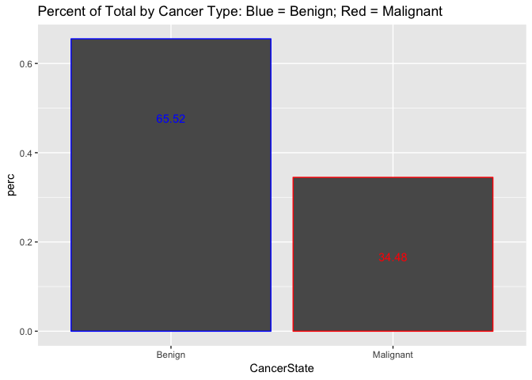
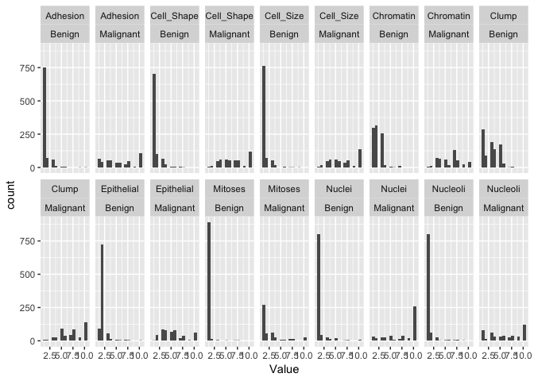

## Load Required Libraries
- TIDYVERSE


## Load Data

- We have some Breast Cancer Data from the Wisconsin Diagnostic Breast Cancer (WDBC) dataset and will first load it in.
- Add an attribute called CancerState, which is similiar to the Class attribute, the difference is that CancerState uses words to describe the condition, meaning when Class == 2, then "Benign" and when Class == 4, then "Malignanat"


```r
wdbc_data <- read.csv("https://raw.githubusercontent.com/tikisen/6372_proj2/master/Data/breast-cancer-wisconsin-data.csv", 
                      sep = ",", 
                      row.names = NULL, 
                      header = TRUE)

entire.dataset <- wdbc_data %>% mutate(CancerState = case_when(Class == 2 ~ "Benign",
                                                                    Class == 4 ~ "Malignanat"))
```

```
## Warning: package 'bindrcpp' was built under R version 3.4.4
```

```r
entire.dataset$CancerState <- as.factor(entire.dataset$CancerState)
```

# Bruce's Work Starts Here

## Summary Statistics/Histograms

```r
entire.dataset %>% select(c(2:12)) %>% summary() 
```

```
##  Clump_Thickness Uniformity_Cell_Size Uniformity_Cell_Shape
##  1      :290     1      :768          1      :706          
##  5      :260     10     :134          2      :118          
##  3      :216     3      :104          10     :116          
##  4      :160     2      : 90          3      :112          
##  10     :138     4      : 80          4      : 88          
##  2      :100     5      : 60          5      : 68          
##  (Other):237     (Other):165          (Other):193          
##  Marginal_Adhesion Single_Epithelial_Cell_Size  Bare_Nuclei 
##  1      :814       2      :772                 1      :804  
##  2      :116       3      :144                 10     :264  
##  3      :116       4      : 96                 2      : 60  
##  10     :110       1      : 94                 5      : 60  
##  4      : 66       6      : 82                 3      : 56  
##  8      : 50       5      : 78                 8      : 42  
##  (Other):129       (Other):135                 (Other):115  
##  Bland_Chromatin Normal_Nucleoli    Mitoses       Class    
##  2      :332     1      :886     1      :1158        :  2  
##  3      :330     10     :122     2      :  70   2    :916  
##  1      :304     3      : 88     3      :  66   4    :482  
##  7      :146     2      : 72     10     :  28   Class:  1  
##  4      : 80     8      : 48     4      :  24              
##  5      : 68     6      : 44     7      :  18              
##  (Other):141     (Other):141     (Other):  37              
##      CancerState 
##  Benign    :916  
##  Malignanat:482  
##  NA's      :  3  
##                  
##                  
##                  
## 
```

```r
# TOTAL COUNT BY CANCER TYPE ####
ggplot(data=entire.dataset, aes(x=CancerState, colour = CancerState)) +
  geom_bar() +
  geom_text(stat='Count', aes(label=..count..), vjust = 10) +
  theme(legend.position = "none") +
  scale_color_manual(values = c("blue", "red")) +
  ggtitle("Total Count by Cancer Type: Blue = Benign; Red = Malignanat") 
```

<!-- -->

```r
# PERCENT OF TOTAL BY CANCER TYPE ####
entire.dataset.percent <- entire.dataset %>% 
  count(CancerState) %>% 
  mutate(perc = n / nrow(entire.dataset))

ggplot(data=entire.dataset.percent, aes(x = CancerState, y = perc, colour = CancerState)) +
  geom_bar(stat = "identity") +
  geom_text(stat = "identity", aes(label=round(perc*100,2)), vjust = 10) +
  theme(legend.position = "none") +
  scale_color_manual(values = c("blue", "red")) +
  ggtitle("Percent of Total by Cancer Type: Blue = Benign; Red = Malignanat")
```

<!-- -->

## Pairs Plots
- Version 1:
- The objective of the "Pairs Plot" is to create plots based upon paring of variables
- Additionaly, each observation is color coded to simutaleniously see if the observation is "Benign" or "Malignanat" cancer.  
  - Color Coding:
    * Blue = Benign 
    * Red = Malignanat


```r
ed.small <- entire.dataset %>% select(-c(1,12))
cols <- character(nrow(ed.small))
cols[] <- "black"
cols[ed.small$Class == 2] <- "blue"
cols[ed.small$Class == 4] <- "red"
pairs(ed.small, col=cols, main = "WDBC Pairs Plot: Blue = Benign; Red = Malignanat")
```

<!-- -->
- Version 2:
- Similar to the first Pairs Plot, however version 2 introduces jitter to the observations and as a result it is easy to see the density of the observations.

```r
# CONVERT TO NUMERIC
ed.small$Clump_Thickness <- as.integer(ed.small$Clump_Thickness)
ed.small$Uniformity_Cell_Size <- as.integer(ed.small$Uniformity_Cell_Size)
ed.small$Uniformity_Cell_Shape <- as.integer(ed.small$Uniformity_Cell_Shape)
ed.small$Marginal_Adhesion <- as.integer(ed.small$Marginal_Adhesion)
ed.small$Single_Epithelial_Cell_Size <- as.integer(ed.small$Single_Epithelial_Cell_Size)
ed.small$Bare_Nuclei <- as.integer(ed.small$Bare_Nuclei)
ed.small$Bland_Chromatin <- as.integer(ed.small$Bland_Chromatin)
ed.small$Normal_Nucleoli <- as.integer(ed.small$Normal_Nucleoli)
ed.small$Mitoses <- as.integer(ed.small$Mitoses)
ed.small$Class <- as.integer(ed.small$Class)

# REDUCE LENGTH OF ATTRIBUTES 
ed.small <- ed.small %>% select(Thick = Clump_Thickness, U_Size = Uniformity_Cell_Size,
                                Shape = Uniformity_Cell_Shape, Adhesion = Marginal_Adhesion,
                                Epi_Size = Single_Epithelial_Cell_Size, Bare = Bare_Nuclei,
                                Bland = Bland_Chromatin, Nucleoli = Normal_Nucleoli, 
                                Mitoses = Mitoses, Class = Class)

# the alpha argument in rgb() lets you set the transparency
cols2 = c(rgb(red=0, green=0, blue=255, alpha=50, maxColorValue=255), 
          rgb(red=255, green=0, blue=0, alpha=50, maxColorValue=255))
cols2 = ifelse(ed.small$Class==2, cols2[1], cols2[2])

# here we jitter the data
set.seed(6141)  # this makes the example exactly reproducible
jbreast = apply(ed.small[,1:9], 2, FUN=function(x){ jitter(x, amount=.5) })
jbreast = cbind(jbreast, class=ed.small[,10])  # the class variable is not jittered

#windows()  # to match up the 1st & 2nd sets requires more coding
layout(matrix(1:25, nrow=5, byrow=T))
par(mar=c(.5,.5,.5,.5), oma=c(2,2,2,2))

for(i in 1:5){
   for(j in 6:10){
    
    plot(jbreast[,j], jbreast[,i], col=cols2, pch=16,
         
         axes=F, main="", xlab="", ylab="")
    
    box()
    
    if(j==6 ){ mtext(colnames(jbreast)[i], side=2, cex=.7, line=1) }
    
    if(i==5 ){ mtext(colnames(jbreast)[j], side=1, cex=.7, line=1) }
    
    if(j==10){ axis(side=4, seq(2,10,2), cex.axis=.8) }
    
    if(i==1 ){ axis(side=3, seq(2,10,2), cex.axis=.8) }
    
  }
  
}
```

<!-- -->
## Histogram
- The histograms are a look at each attribute broken down by CancerState

```r
ed.small <- entire.dataset %>% select(-c(1,11))

ed.small$Clump_Thickness <- as.integer(ed.small$Clump_Thickness)
ed.small$Uniformity_Cell_Size <- as.integer(ed.small$Uniformity_Cell_Size)
ed.small$Uniformity_Cell_Shape <- as.integer(ed.small$Uniformity_Cell_Shape)
ed.small$Marginal_Adhesion <- as.integer(ed.small$Marginal_Adhesion)
ed.small$Single_Epithelial_Cell_Size <- as.integer(ed.small$Single_Epithelial_Cell_Size)
ed.small$Bare_Nuclei <- as.integer(ed.small$Bare_Nuclei)
ed.small$Bland_Chromatin <- as.integer(ed.small$Bland_Chromatin)
ed.small$Normal_Nucleoli <- as.integer(ed.small$Normal_Nucleoli)
ed.small$Mitoses <- as.integer(ed.small$Mitoses)

ed.tall <- ed.small %>% 
    select(Clump = Clump_Thickness, Cell_Size = Uniformity_Cell_Size, 
         Cell_Shape = Uniformity_Cell_Shape, Adhesion = Marginal_Adhesion,
         Epithelial = Single_Epithelial_Cell_Size, Nuclei = Bare_Nuclei,
         Chromatin = Bland_Chromatin, Nucleoli = Normal_Nucleoli, everything()) %>%
  gather(-10, key = "Variable", value = "Value") %>% 
  filter(!is.na(CancerState))

ggplot(data = ed.tall, aes(x=Value)) +
  geom_histogram(bins=15) + 
  facet_wrap(Variable ~ CancerState, ncol = 9)
```

<!-- -->

# Bruce's Work Ends Here

# Rick's Work Starts Here

## Including Plots

You can also embed plots, for example:


```
## 
## Attaching package: 'MASS'
```

```
## The following object is masked from 'package:dplyr':
## 
##     select
```

```
##                1   10    2    3    4    5    6    7    8 Mitoses  Sum
##                                                                      
##           2    0    0    0    0    0    0    0    0    0       0    2
## 2         0  890    0   16    4    0    2    0    2    2       0  916
## 4         0  268   28   54   62   24   10    6   16   14       0  482
## Class     0    0    0    0    0    0    0    0    0    0       1    1
## Sum       2 1158   28   70   66   24   12    6   18   16       1 1401
```

```
##        
##                             1         10          2          3          4
##         1.00000000 0.00000000 0.00000000 0.00000000 0.00000000 0.00000000
##   2     0.00000000 0.76856649 0.00000000 0.22857143 0.06060606 0.00000000
##   4     0.00000000 0.23143351 1.00000000 0.77142857 0.93939394 1.00000000
##   Class 0.00000000 0.00000000 0.00000000 0.00000000 0.00000000 0.00000000
##        
##                  5          6          7          8    Mitoses
##         0.00000000 0.00000000 0.00000000 0.00000000 0.00000000
##   2     0.16666667 0.00000000 0.11111111 0.12500000 0.00000000
##   4     0.83333333 1.00000000 0.88888889 0.87500000 0.00000000
##   Class 0.00000000 0.00000000 0.00000000 0.00000000 1.00000000
```

# Rick's Work Ends Here

#TQ's Work Starts Here

Note that the `echo = FALSE` parameter was added to the code chunk to prevent printing of the R code that generated the plot.


#TQ's Work Ends Here
