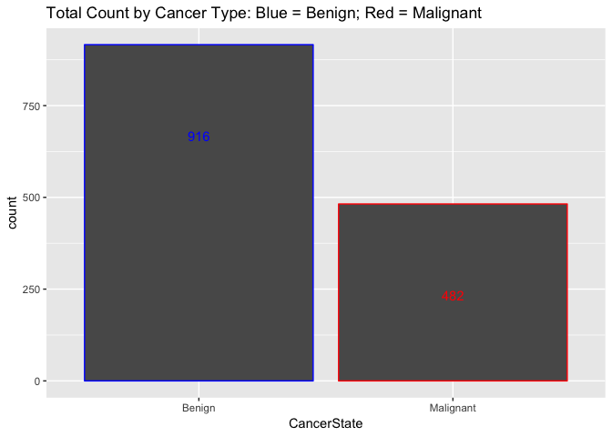

## Load Required Libraries
- TIDYVERSE
- Amelia
- Corrplot


## Load Data

- We using the Breast Cancer Data from the Wisconsin Diagnostic Breast Cancer (WDBC) dataset and will first load it.


```r
wdbc_data <- read.csv("https://raw.githubusercontent.com/tikisen/6372_proj2/master/Data/breast-cancer-wisconsin-data.csv", 
                      sep = ",", 
                      row.names = NULL, 
                      header = TRUE,
                      na.strings = c(""),
                      stringsAsFactors = FALSE)

wdbc_data <- wdbc_data %>% filter(ID !="Sample_code_number")
```

```
## Warning: package 'bindrcpp' was built under R version 3.4.4
```

# Bruce's Work Starts Here

## Check for missing values

```r
sapply(wdbc_data,function(x) sum(is.na(x)))
```

```
##                          ID             Clump_Thickness 
##                           0                           2 
##        Uniformity_Cell_Size       Uniformity_Cell_Shape 
##                           2                           2 
##           Marginal_Adhesion Single_Epithelial_Cell_Size 
##                           2                           2 
##                 Bare_Nuclei             Bland_Chromatin 
##                           2                           2 
##             Normal_Nucleoli                     Mitoses 
##                           2                           2 
##                       Class 
##                           2
```

- The above output identifies there is missing data in each of the attributes, but what is not clear at this point if the missing values are for the same of different IDs.

- The following visualizes where the missing data is occurring:


```r
missmap(wdbc_data, main = "Missing values vs observed")
```

<!-- -->

- The above visualization shows that the missing feature values are missing from the same ID.  Since each of the respective ID's is missing values for all of the fetures it doesn't make since to impute values, therefore each of the records will be removed from the data set. 


```r
wdbc.data <- wdbc_data %>% 
  filter(!is.na(wdbc_data$Uniformity_Cell_Shape))
rm(wdbc_data)
```

- Attributes will be coerced from character to numeric data type. 
- 32 NA will be introduced into the Bare_Nuclei attribute, the median will replace the NA values.
- Add an attribute called CancerState, which is similiar to the Class attribute, the difference is that CancerState uses words to describe the condition, meaning when Class == 2, then "Benign" and when Class == 4, then "Malignanat"


```r
wdbc.data$ID <- as.integer(wdbc.data$ID)
wdbc.data$Clump_Thickness <- as.integer(wdbc.data$Clump_Thickness)
wdbc.data$Uniformity_Cell_Size <- as.integer(wdbc.data$Uniformity_Cell_Size)
wdbc.data$Uniformity_Cell_Shape <- as.integer(wdbc.data$Uniformity_Cell_Shape)
wdbc.data$Marginal_Adhesion <- as.integer(wdbc.data$Marginal_Adhesion)
wdbc.data$Single_Epithelial_Cell_Size <- as.integer(wdbc.data$Single_Epithelial_Cell_Size)
wdbc.data$Bare_Nuclei <- as.integer(wdbc.data$Bare_Nuclei)
```

```
## Warning: NAs introduced by coercion
```

```r
wdbc.data$Bland_Chromatin <- as.integer(wdbc.data$Bland_Chromatin)
wdbc.data$Normal_Nucleoli <- as.integer(wdbc.data$Normal_Nucleoli)
wdbc.data$Mitoses <- as.integer(wdbc.data$Mitoses)
wdbc.data$Class <- as.integer(wdbc.data$Class)

wdbc.data <- wdbc.data %>%
  select(ID = ID, Clump = Clump_Thickness, Cell_Size = Uniformity_Cell_Size, 
         Cell_Shape = Uniformity_Cell_Shape, Adhesion = Marginal_Adhesion,
         Epithelial = Single_Epithelial_Cell_Size, Nuclei = Bare_Nuclei,
         Chromatin = Bland_Chromatin, Nucleoli = Normal_Nucleoli, everything())

wdbc.data %>% select(Nuclei) %>% summary()
```

```
##      Nuclei      
##  Min.   : 1.000  
##  1st Qu.: 1.000  
##  Median : 1.000  
##  Mean   : 3.545  
##  3rd Qu.: 6.000  
##  Max.   :10.000  
##  NA's   :32
```

```r
wdbc.data$Nuclei <- ifelse(is.na(wdbc.data$Nuclei),
                           median(wdbc.data$Nuclei, na.rm=TRUE), 
                           wdbc.data$Nuclei)

wdbc.data %>% select(Nuclei) %>% summary()
```

```
##      Nuclei      
##  Min.   : 1.000  
##  1st Qu.: 1.000  
##  Median : 1.000  
##  Mean   : 3.486  
##  3rd Qu.: 5.000  
##  Max.   :10.000
```

```r
entire.dataset <- wdbc.data %>% 
  mutate(CancerState = case_when(Class == 2 ~ "Benign",
                                 Class == 4 ~ "Malignanat"))

entire.dataset$CancerState <- as.factor(entire.dataset$CancerState)
```


## Summary Statistics/Histograms

```r
entire.dataset %>% select(c(2:12)) %>% summary() 
```

```
##      Clump          Cell_Size        Cell_Shape        Adhesion     
##  Min.   : 1.000   Min.   : 1.000   Min.   : 1.000   Min.   : 1.000  
##  1st Qu.: 2.000   1st Qu.: 1.000   1st Qu.: 1.000   1st Qu.: 1.000  
##  Median : 4.000   Median : 1.000   Median : 1.000   Median : 1.000  
##  Mean   : 4.418   Mean   : 3.134   Mean   : 3.207   Mean   : 2.807  
##  3rd Qu.: 6.000   3rd Qu.: 5.000   3rd Qu.: 5.000   3rd Qu.: 4.000  
##  Max.   :10.000   Max.   :10.000   Max.   :10.000   Max.   :10.000  
##    Epithelial         Nuclei         Chromatin         Nucleoli     
##  Min.   : 1.000   Min.   : 1.000   Min.   : 1.000   Min.   : 1.000  
##  1st Qu.: 2.000   1st Qu.: 1.000   1st Qu.: 2.000   1st Qu.: 1.000  
##  Median : 2.000   Median : 1.000   Median : 3.000   Median : 1.000  
##  Mean   : 3.216   Mean   : 3.486   Mean   : 3.438   Mean   : 2.867  
##  3rd Qu.: 4.000   3rd Qu.: 5.000   3rd Qu.: 5.000   3rd Qu.: 4.000  
##  Max.   :10.000   Max.   :10.000   Max.   :10.000   Max.   :10.000  
##     Mitoses           Class          CancerState 
##  Min.   : 1.000   Min.   :2.00   Benign    :916  
##  1st Qu.: 1.000   1st Qu.:2.00   Malignanat:482  
##  Median : 1.000   Median :2.00                   
##  Mean   : 1.589   Mean   :2.69                   
##  3rd Qu.: 1.000   3rd Qu.:4.00                   
##  Max.   :10.000   Max.   :4.00
```

```r
# TOTAL COUNT BY CANCER TYPE ####
ggplot(data=entire.dataset, aes(x=CancerState, colour = CancerState)) +
  geom_bar() +
  geom_text(stat='Count', aes(label=..count..), vjust = 10) +
  theme(legend.position = "none") +
  scale_color_manual(values = c("blue", "red")) +
  ggtitle("Total Count by Cancer Type: Blue = Benign; Red = Malignanat") 
```

<!-- -->

```r
# PERCENT OF TOTAL BY CANCER TYPE ####
entire.dataset.percent <- entire.dataset %>% 
  count(CancerState) %>% 
  mutate(perc = n / nrow(entire.dataset))

ggplot(data=entire.dataset.percent, aes(x = CancerState, y = perc, colour = CancerState)) +
  geom_bar(stat = "identity") +
  geom_text(stat = "identity", aes(label=round(perc*100,2)), vjust = 10) +
  theme(legend.position = "none") +
  scale_color_manual(values = c("blue", "red")) +
  ggtitle("Percent of Total by Cancer Type: Blue = Benign; Red = Malignanat")
```

<!-- -->

```r
rm(entire.dataset.percent) 
```

## Pairs Plots
- Version 1:
- The objective of the "Pairs Plot" is to create plots based upon paring of variables
- Additionaly, each observation is color coded to simutaleniously see if the observation is "Benign" or "Malignanat" cancer.  
  - Color Coding:
    * Blue = Benign 
    * Red = Malignanat


```r
ed.small <- entire.dataset %>% select(-c(1,12))
cols <- character(nrow(ed.small))
cols[] <- "black"
cols[ed.small$Class == 2] <- "blue"
cols[ed.small$Class == 4] <- "red"
pairs(ed.small, col=cols, main = "WDBC Pairs Plot: Blue = Benign; Red = Malignanat")
```

<!-- -->

```r
rm(cols)
```

- Version 2:
- Similar to the first Pairs Plot, however version 2 introduces jitter to the observations and as a result it is easy to see the density of the observations.


```r
# the alpha argument in rgb() lets you set the transparency
cols2 = c(rgb(red=0, green=0, blue=255, alpha=50, maxColorValue=255), 
          rgb(red=255, green=0, blue=0, alpha=50, maxColorValue=255))
cols2 = ifelse(ed.small$Class==2, cols2[1], cols2[2])

# here we jitter the data
set.seed(6141)  # this makes the example exactly reproducible
jbreast = apply(ed.small[,1:9], 2, FUN=function(x){ jitter(x, amount=.5) })
jbreast = cbind(jbreast, class=ed.small[,10])  # the class variable is not jittered

#windows()  # to match up the 1st & 2nd sets requires more coding
layout(matrix(1:25, nrow=5, byrow=T))
par(mar=c(.5,.5,.5,.5), oma=c(2,2,2,2))

for(i in 1:5){
   for(j in 6:10){
    
    plot(jbreast[,j], jbreast[,i], col=cols2, pch=16,
         
         axes=F, main="", xlab="", ylab="")
    
    box()
    
    if(j==6 ){ mtext(colnames(jbreast)[i], side=2, cex=.7, line=1) }
    
    if(i==5 ){ mtext(colnames(jbreast)[j], side=1, cex=.7, line=1) }
    
    if(j==10){ axis(side=4, seq(2,10,2), cex.axis=.8) }
    
    if(i==1 ){ axis(side=3, seq(2,10,2), cex.axis=.8) }
    
  }
  
}
```

<!-- -->

```r
rm(list = c("jbreast", "cols2", "i", "j"))
```

## Corrleation Plot
- Positive correlations are displayed in blue and negative correlations in red color.
- Color intensity and the size of the circle are proportional to the correlation coefficients.


```r
corr <- cor(ed.small)
corrplot(corr, method ="number", type= "upper")
```

<!-- -->

```r
corrplot(corr, method ="circle", type= "upper")
```

<!-- -->

```r
rm(corr)
```

## Histogram
- The histograms are a look at each attribute broken down by CancerState

```r
ed.small <- entire.dataset %>% select(-c(1,11))

ed.tall <- ed.small %>%
  gather(-10, key = "Variable", value = "Value") %>% 
  filter(!is.na(CancerState))

ggplot(data = ed.tall, aes(x=Value)) +
  geom_histogram(bins=15) + 
  facet_wrap(Variable ~ CancerState, ncol = 9)
```

<!-- -->


```r
# BOXPLOT ####

ed.tall <- ed.small %>% 
  gather(-10, key = "Variable", value = "Value") %>% 
  filter(!is.na(CancerState))

ggplot(ed.tall, aes(x=CancerState, y=Value, fill = CancerState)) + 
  geom_boxplot() +
  facet_wrap(~ Variable) +
  ggtitle("WDBC Boxplot ") + 
  scale_fill_manual(breaks = c("Benign", "Malignanat"), values = c("blue", "red")) +
  theme(legend.position="none")
```

<!-- -->


# Bruce's Work Ends Here

# Rick's Work Starts Here

## Including Plots

You can also embed plots, for example:


# Rick's Work Ends Here

#TQ's Work Starts Here

Note that the `echo = FALSE` parameter was added to the code chunk to prevent printing of the R code that generated the plot.


#TQ's Work Ends Here
