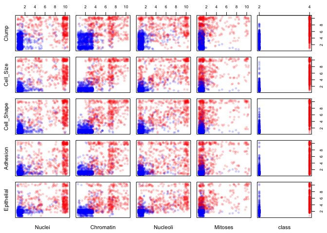
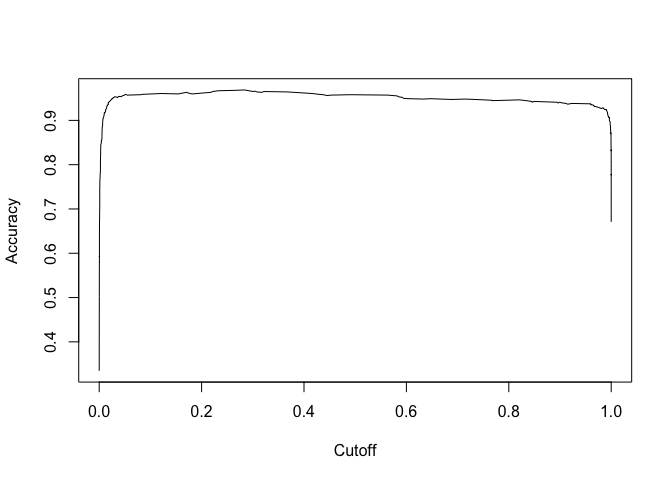
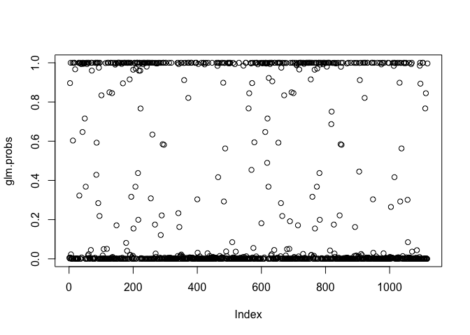
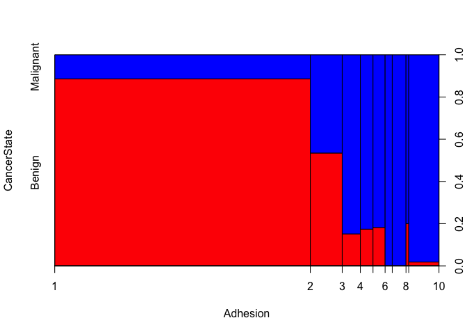
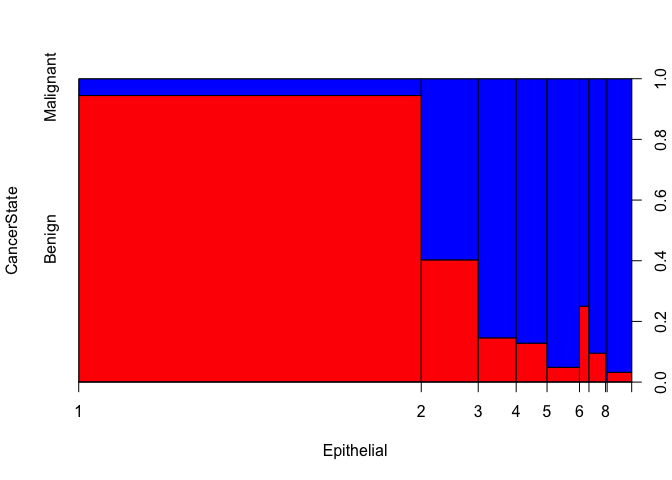
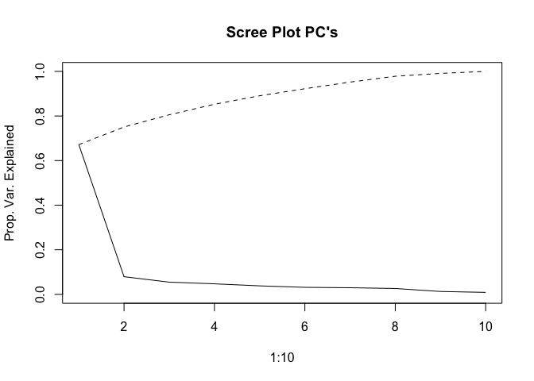
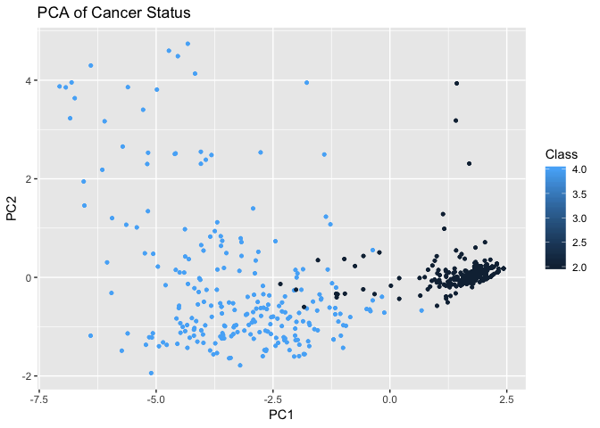
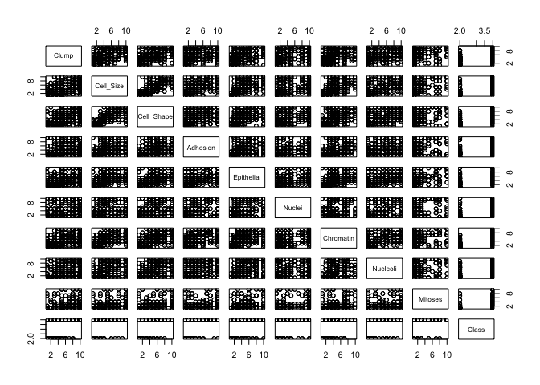

## Load Required Libraries
- Tidyverse 
- Amelia
- Corrplot
- PSCL


## Load Data

- We are using the Breast Cancer Data from the Wisconsin Diagnostic Breast Cancer (WDBC) dataset and will first load it.


```r
wdbc_data <- read.csv("https://raw.githubusercontent.com/tikisen/6372_proj2/master/Data/breast-cancer-wisconsin-data.csv", 
                      sep = ",", 
                      row.names = NULL, 
                      header = TRUE,
                      na.strings = c(""),
                      stringsAsFactors = FALSE)

wdbc_data <- wdbc_data %>% filter(ID !="Sample_code_number")
```

# Bruce's Work Starts Here

## Check for missing values

```r
sapply(wdbc_data,function(x) sum(is.na(x)))
```

```
##                          ID             Clump_Thickness 
##                           0                           2 
##        Uniformity_Cell_Size       Uniformity_Cell_Shape 
##                           2                           2 
##           Marginal_Adhesion Single_Epithelial_Cell_Size 
##                           2                           2 
##                 Bare_Nuclei             Bland_Chromatin 
##                           2                           2 
##             Normal_Nucleoli                     Mitoses 
##                           2                           2 
##                       Class 
##                           2
```

- The above output identifies there is missing data in each of the attributes, but what is not clear at this point if the missing values are for the same of different IDs.

- The following visualizes where the missing data is occurring:


```r
missmap(wdbc_data, main = "Missing values vs observed")
```

<!-- -->

- The above visualization shows that the missing feature values are missing from the same ID.  Since each of the respective ID's is missing values for all of the fetures it doesn't make since to impute values, therefore each of the records will be removed from the data set. 


```r
wdbc.data <- wdbc_data %>% 
  filter(!is.na(wdbc_data$Uniformity_Cell_Shape))
rm(wdbc_data)
```

- Attributes will be coerced from character to numeric data type. 
- 32 NA will be introduced into the Bare_Nuclei attribute, the median will replace the NA values.
- Add an attribute called CancerState, which is similiar to the Class attribute, the difference is that CancerState uses words to describe the condition, meaning when Class == 2, then "Benign" and when Class == 4, then "Malignant "


```r
wdbc.data$ID <- as.integer(wdbc.data$ID)
wdbc.data$Clump_Thickness <- as.integer(wdbc.data$Clump_Thickness)
wdbc.data$Uniformity_Cell_Size <- as.integer(wdbc.data$Uniformity_Cell_Size)
wdbc.data$Uniformity_Cell_Shape <- as.integer(wdbc.data$Uniformity_Cell_Shape)
wdbc.data$Marginal_Adhesion <- as.integer(wdbc.data$Marginal_Adhesion)
wdbc.data$Single_Epithelial_Cell_Size <- as.integer(wdbc.data$Single_Epithelial_Cell_Size)
wdbc.data$Bare_Nuclei <- as.integer(wdbc.data$Bare_Nuclei)
```

```
## Warning: NAs introduced by coercion
```

```r
wdbc.data$Bland_Chromatin <- as.integer(wdbc.data$Bland_Chromatin)
wdbc.data$Normal_Nucleoli <- as.integer(wdbc.data$Normal_Nucleoli)
wdbc.data$Mitoses <- as.integer(wdbc.data$Mitoses)
wdbc.data$Class <- as.integer(wdbc.data$Class)

wdbc.data <- wdbc.data %>%
  dplyr::select(ID, Clump = Clump_Thickness, Cell_Size = Uniformity_Cell_Size, 
         Cell_Shape = Uniformity_Cell_Shape, Adhesion = Marginal_Adhesion,
         Epithelial = Single_Epithelial_Cell_Size, Nuclei = Bare_Nuclei,
         Chromatin = Bland_Chromatin, Nucleoli = Normal_Nucleoli, everything())

wdbc.data %>% dplyr::select(Nuclei) %>% summary()
```

```
##      Nuclei      
##  Min.   : 1.000  
##  1st Qu.: 1.000  
##  Median : 1.000  
##  Mean   : 3.545  
##  3rd Qu.: 6.000  
##  Max.   :10.000  
##  NA's   :32
```

```r
wdbc.data$Nuclei <- ifelse(is.na(wdbc.data$Nuclei),
                           median(wdbc.data$Nuclei, na.rm=TRUE), 
                           wdbc.data$Nuclei)

wdbc.data %>% dplyr::select(Nuclei) %>% summary()
```

```
##      Nuclei      
##  Min.   : 1.000  
##  1st Qu.: 1.000  
##  Median : 1.000  
##  Mean   : 3.486  
##  3rd Qu.: 5.000  
##  Max.   :10.000
```

```r
entire.dataset <- wdbc.data %>% 
  mutate(CancerState = case_when(Class == 2 ~ "Benign",
                                 Class == 4 ~ "Malignant"))

entire.dataset$CancerState <- as.factor(entire.dataset$CancerState)
```


## Summary Statistics/Histograms

```r
entire.dataset %>% dplyr::select(c(2:12)) %>% summary() 
```

```
##      Clump          Cell_Size        Cell_Shape        Adhesion     
##  Min.   : 1.000   Min.   : 1.000   Min.   : 1.000   Min.   : 1.000  
##  1st Qu.: 2.000   1st Qu.: 1.000   1st Qu.: 1.000   1st Qu.: 1.000  
##  Median : 4.000   Median : 1.000   Median : 1.000   Median : 1.000  
##  Mean   : 4.418   Mean   : 3.134   Mean   : 3.207   Mean   : 2.807  
##  3rd Qu.: 6.000   3rd Qu.: 5.000   3rd Qu.: 5.000   3rd Qu.: 4.000  
##  Max.   :10.000   Max.   :10.000   Max.   :10.000   Max.   :10.000  
##    Epithelial         Nuclei         Chromatin         Nucleoli     
##  Min.   : 1.000   Min.   : 1.000   Min.   : 1.000   Min.   : 1.000  
##  1st Qu.: 2.000   1st Qu.: 1.000   1st Qu.: 2.000   1st Qu.: 1.000  
##  Median : 2.000   Median : 1.000   Median : 3.000   Median : 1.000  
##  Mean   : 3.216   Mean   : 3.486   Mean   : 3.438   Mean   : 2.867  
##  3rd Qu.: 4.000   3rd Qu.: 5.000   3rd Qu.: 5.000   3rd Qu.: 4.000  
##  Max.   :10.000   Max.   :10.000   Max.   :10.000   Max.   :10.000  
##     Mitoses           Class         CancerState 
##  Min.   : 1.000   Min.   :2.00   Benign   :916  
##  1st Qu.: 1.000   1st Qu.:2.00   Malignant:482  
##  Median : 1.000   Median :2.00                  
##  Mean   : 1.589   Mean   :2.69                  
##  3rd Qu.: 1.000   3rd Qu.:4.00                  
##  Max.   :10.000   Max.   :4.00
```

```r
# TOTAL COUNT BY CANCER TYPE ####
ggplot(data=entire.dataset, aes(x=CancerState, colour = CancerState)) +
  geom_bar() +
  geom_text(stat='Count', aes(label=..count..), vjust = 10) +
  theme(legend.position = "none") +
  scale_color_manual(values = c("blue", "red")) +
  ggtitle("Total Count by Cancer Type: Blue = Benign; Red = Malignant ") 
```

<!-- -->

```r
# PERCENT OF TOTAL BY CANCER TYPE ####
entire.dataset.percent <- entire.dataset %>% 
  count(CancerState) %>% 
  mutate(perc = n / nrow(entire.dataset))

ggplot(data=entire.dataset.percent, aes(x = CancerState, y = perc, colour = CancerState)) +
  geom_bar(stat = "identity") +
  geom_text(stat = "identity", aes(label=round(perc*100,2)), vjust = 10) +
  theme(legend.position = "none") +
  scale_color_manual(values = c("blue", "red")) +
  ggtitle("Percent of Total by Cancer Type: Blue = Benign; Red = Malignant ")
```

<!-- -->

```r
rm(entire.dataset.percent) 
```

- Ideally, the proportion of events and non-events in the Y variable should approximately be the same.
- From the above histograms it is obvious there is a class bias, a condition observed when the Malignant proportion of events is much smaller than proportion of Benign events, by a factor of 1 to 1.9.  
- As a result, we must sample the observations in approximately equal proportions in order to get better model.  Unfortunately we have a small sample size, which means we are not able to implement this strategy. 
 
## Pairs Plots
- Version 1:
- The objective of the "Pairs Plot" is to create plots based upon paring of variables
- Additionaly, each observation is color coded to simutaleniously see if the observation is "Benign" or "Malignant " cancer.  
  - Color Coding:
    * Blue = Benign 
    * Red = Malignant 


```r
ed.small <- entire.dataset %>% dplyr::select(-c(1,12))

cols <- character(nrow(ed.small))
cols[] <- "black"
cols[ed.small$Class == 2] <- "blue"
cols[ed.small$Class == 4] <- "red"
pairs(ed.small, col=cols, main = "WDBC Pairs Plot: Blue = Benign; Red = Malignant ")
```

<!-- -->

```r
rm(cols)
```

- Version 2:
- Similar to the first Pairs Plot, however version 2 introduces jitter to the observations and as a result it is easy to see the density of the observations.


```r
# the alpha argument in rgb() lets you set the transparency
cols2 = c(rgb(red=0, green=0, blue=255, alpha=50, maxColorValue=255), 
          rgb(red=255, green=0, blue=0, alpha=50, maxColorValue=255))
cols2 = ifelse(ed.small$Class==2, cols2[1], cols2[2])

# here we jitter the data
set.seed(6141)  # this makes the example exactly reproducible
jbreast = apply(ed.small[,1:9], 2, FUN=function(x){ jitter(x, amount=.5) })
jbreast = cbind(jbreast, class=ed.small[,10])  # the class variable is not jittered

#windows()  # to match up the 1st & 2nd sets requires more coding
layout(matrix(1:25, nrow=5, byrow=T))
par(mar=c(.5,.5,.5,.5), oma=c(2,2,2,2))

for(i in 1:5){
   for(j in 6:10){
    
    plot(jbreast[,j], jbreast[,i], col=cols2, pch=16,
         
         axes=F, main="", xlab="", ylab="")
    
    box()
    
    if(j==6 ){ mtext(colnames(jbreast)[i], side=2, cex=.7, line=1) }
    
    if(i==5 ){ mtext(colnames(jbreast)[j], side=1, cex=.7, line=1) }
    
    if(j==10){ axis(side=4, seq(2,10,2), cex.axis=.8) }
    
    if(i==1 ){ axis(side=3, seq(2,10,2), cex.axis=.8) }
    
  }
  
}
```

<!-- -->

```r
rm(list = c("jbreast", "cols2", "i", "j"))
```

## Corrleation Plot
- Positive correlations are displayed in blue and negative correlations in red color.
- Color intensity and the size of the circle are proportional to the correlation coefficients.


```r
corr <- cor(ed.small)
corrplot(corr, method ="number", type= "upper")
```

<!-- -->

```r
corrplot(corr, method ="circle", type= "upper")
```

<!-- -->

```r
rm(corr)
```

## Histogram
- The histograms are a look at each attribute broken down by CancerState


```r
ed.small <- entire.dataset %>% dplyr::select(-c(1,11))

ed.tall <- ed.small %>%
  gather(-10, key = "Variable", value = "Value") %>% 
  filter(!is.na(CancerState))

ggplot(data = ed.tall, aes(x=Value)) +
  geom_histogram(bins=15) + 
  facet_wrap(Variable ~ CancerState, ncol = 9)
```

<!-- -->

## Boxplots
- Boxplot of attributes, color by CancerState


```r
ed.tall <- ed.small %>% 
  gather(-10, key = "Variable", value = "Value") %>% 
  filter(!is.na(CancerState))

ggplot(ed.tall, aes(x=CancerState, y=Value, fill = CancerState)) + 
  geom_boxplot() +
  facet_wrap(~ Variable) +
  ggtitle("WDBC Boxplot ") + 
  scale_fill_manual(breaks = c("Benign", "Malignant "), values = c("blue", "red")) +
  theme(legend.position="none")
```

<!-- -->

## MODEL SELECTION
- In stepwise regression, the full model is passed to a *step* function. The stepwise function iteratively searches the full scope of variables.
- The iteration will be performed in a forward and backwards directions.
- In a backward selection, the *step* function performs multiple iteractions by droping one independent variable at a time.  
- In a forward selection, the *step* function performs multiple iteractions by adding one independent variable at a time.
- In each (forward and backward) iteration, multiple models are built and the AIC of the models is computed and the model that yields the lowest AIC is retained for the next iteration.  


```r
wdbc.data.2 <- wdbc.data %>% dplyr::select(-ID)

lmMod <- lm(Class ~ . , data = wdbc.data.2)
selectedMod <- step(lmMod, direction = "forward")
```

```
## Start:  AIC=-2673.1
## Class ~ Clump + Cell_Size + Cell_Shape + Adhesion + Epithelial + 
##     Nuclei + Chromatin + Nucleoli + Mitoses
```

```r
all.vifs <- car::vif(selectedMod)
print(all.vifs)
```

```
##      Clump  Cell_Size Cell_Shape   Adhesion Epithelial     Nuclei 
##   1.913657   7.191346   6.497428   2.459211   2.545028   2.537651 
##  Chromatin   Nucleoli    Mitoses 
##   2.869984   2.440694   1.388399
```

- When using a forward selection, all nine variables are retained in the model selection.


```r
selectedMod <- step(lmMod, direction = "backward")
```

```
## Start:  AIC=-2673.1
## Class ~ Clump + Cell_Size + Cell_Shape + Adhesion + Epithelial + 
##     Nuclei + Chromatin + Nucleoli + Mitoses
## 
##              Df Sum of Sq    RSS     AIC
## - Mitoses     1     0.076 203.73 -2674.6
## <none>                    203.65 -2673.1
## - Epithelial  1     0.577 204.23 -2671.1
## - Adhesion    1     0.589 204.24 -2671.1
## - Cell_Shape  1     2.111 205.76 -2660.7
## - Cell_Size   1     3.607 207.26 -2650.6
## - Chromatin   1     4.908 208.56 -2641.8
## - Nucleoli    1     6.581 210.23 -2630.6
## - Clump       1    23.902 227.55 -2519.9
## - Nuclei      1    62.019 265.67 -2303.4
## 
## Step:  AIC=-2674.58
## Class ~ Clump + Cell_Size + Cell_Shape + Adhesion + Epithelial + 
##     Nuclei + Chromatin + Nucleoli
## 
##              Df Sum of Sq    RSS     AIC
## <none>                    203.73 -2674.6
## - Adhesion    1     0.654 204.38 -2672.1
## - Epithelial  1     0.690 204.42 -2671.8
## - Cell_Shape  1     2.113 205.84 -2662.2
## - Cell_Size   1     3.663 207.39 -2651.7
## - Chromatin   1     4.839 208.56 -2643.8
## - Nucleoli    1     6.828 210.55 -2630.5
## - Clump       1    24.176 227.90 -2519.8
## - Nuclei      1    61.944 265.67 -2305.4
```

```r
all.vifs <- car::vif(selectedMod)
print(all.vifs)
```

```
##      Clump  Cell_Size Cell_Shape   Adhesion Epithelial     Nuclei 
##   1.905723   7.176186   6.497372   2.419999   2.446095   2.534515 
##  Chromatin   Nucleoli 
##   2.848059   2.409681
```

- When using a backward selection, eight variables are retained in the model selection, only Mitoses is omitted from the model selection.

## Logistic Regression
- Following the established discipline of dividing a portion of the dataset into a training set and the remainder into a test set.
- The training set will be used to build the model and the test set will be used to validate the model.
- The training set will consist of 20% of the data and the test set will consist of the remaining 80%.
- A set.seed is used at the beginning of the test and training division in order to get reproducible results.

```r
wdbc.data.2 <-  wdbc.data %>% mutate(Class2 = case_when(Class == 2 ~ 0,
                                                        Class == 4 ~ 1)) %>%
 dplyr::select(Clump, Cell_Size, Cell_Shape, Adhesion, Epithelial, Nuclei,
               Chromatin, Nucleoli, Mitoses, Class = Class2)

wdbc.data.2$Class <- as.factor(wdbc.data.2$Class)

set.seed(12345) #to get repeatable data

#wdbc.train <- sample_frac(ed.small, 0.2, replace = FALSE)
wdbc.train <- sample_frac(wdbc.data.2, 0.2, replace = FALSE)

train.index <- as.numeric(rownames(wdbc.train))
#wdbc.test <- ed.small[-train.index,]
wdbc.test <- wdbc.data.2[-train.index,]

rm(train.index)

# MODEL FITTING
# wdbc.glm.fit <- glm(CancerState ~ ., data = wdbc.train, family = binomial(link = "logit"))
# wdbc.glm.fit <- glm(CancerState ~ ., data = wdbc.train, family = "binomial")
wdbc.glm.fit <- glm(Class ~ ., data = wdbc.train, family = "binomial")
summary(wdbc.glm.fit)
```

```
## 
## Call:
## glm(formula = Class ~ ., family = "binomial", data = wdbc.train)
## 
## Deviance Residuals: 
##      Min        1Q    Median        3Q       Max  
## -1.52446  -0.05968  -0.01665   0.00444   2.53104  
## 
## Coefficients:
##             Estimate Std. Error z value Pr(>|z|)    
## (Intercept) -14.2120     3.2378  -4.389 1.14e-05 ***
## Clump         0.8169     0.2999   2.724  0.00646 ** 
## Cell_Size    -0.9366     0.3984  -2.351  0.01874 *  
## Cell_Shape    0.9847     0.4535   2.171  0.02989 *  
## Adhesion      0.5168     0.1825   2.831  0.00464 ** 
## Epithelial   -0.5541     0.2756  -2.010  0.04440 *  
## Nuclei        0.5243     0.1789   2.930  0.00338 ** 
## Chromatin     0.8176     0.3005   2.720  0.00652 ** 
## Nucleoli      0.8661     0.2727   3.177  0.00149 ** 
## Mitoses       1.6154     0.9805   1.647  0.09946 .  
## ---
## Signif. codes:  0 '***' 0.001 '**' 0.01 '*' 0.05 '.' 0.1 ' ' 1
## 
## (Dispersion parameter for binomial family taken to be 1)
## 
##     Null deviance: 373.40  on 279  degrees of freedom
## Residual deviance:  40.14  on 270  degrees of freedom
## AIC: 60.14
## 
## Number of Fisher Scoring iterations: 9
```

Assessing Model Fit:

The following attributes are NOT statistically significant:  
* Cell_Size  
* Epithelial  
  
The following attributes ARE statistically significant:  
* Clump  
* Nuclei  
* Chromatin  
* Adhesion  
* Cell_Shape  
* Mitoses  
  
- In this logit model, the response valirable (CancerState) is log odds, a unit increase in Clump increases the odds by 0.6, a unit increase in Nuclei increases the odds by 0.4, and a unit increase in Chromatin increases the odds by 0.5.
- The null deviance (the deviance just for the mean) is 1271 and the residual deviance (the deviance for the model) is 171.
- The difference between the null deviance and the residual deviance shows how the model is doing against the null model (a model with only the intercept). The wider the gap between the null deviance and the residual deviance, the better.
- Analyzing the table we can see the drop in deviance when adding each variable one at a time, with the exception of when adding Nuclei and Chromatin.
- With the addition of Clump significantly reduces the residual deviance and each additional attribute reduces the residual deviance, but in much smaller increments.


```r
anova(wdbc.glm.fit, test = "Chisq")
```

```
## Analysis of Deviance Table
## 
## Model: binomial, link: logit
## 
## Response: Class
## 
## Terms added sequentially (first to last)
## 
## 
##            Df Deviance Resid. Df Resid. Dev  Pr(>Chi)    
## NULL                         279     373.40              
## Clump       1  151.984       278     221.42 < 2.2e-16 ***
## Cell_Size   1  109.367       277     112.05 < 2.2e-16 ***
## Cell_Shape  1   17.027       276      95.03 3.686e-05 ***
## Adhesion    1    9.118       275      85.91  0.002531 ** 
## Epithelial  1    0.253       274      85.65  0.614766    
## Nuclei      1   15.388       273      70.27 8.754e-05 ***
## Chromatin   1    8.767       272      61.50  0.003068 ** 
## Nucleoli    1   16.426       271      45.07 5.060e-05 ***
## Mitoses     1    4.934       270      40.14  0.026326 *  
## ---
## Signif. codes:  0 '***' 0.001 '**' 0.01 '*' 0.05 '.' 0.1 ' ' 1
```

Assessing Table of Deviance (ToD):

From the ToD we are able to see the difference between the null deviance versus the residual deviance.  The ToD shows how our model is doing against the null model, which is a model with only the intercept. The wider this gap between the model versus the null, the better.

By adding Clump and Cell_Size to the model drastically reduces the residual deviance.  All attributes have 0.05 p-value or less.

Eventhough there is not an exact equivalent to the R2 of linear regression exists, the McFadden R2 index can be used to assess the model fit:

```r
pr2_mc <- pR2(wdbc.glm.fit)
pr2_mc[[4]]
```

```
## [1] 0.8925029
```

Assessing the predictive ability of the logistic regression model by predicting from test dataset using against the training dataset:
- The predict function provides probabilities of classification
- Using a probabilities from the predict function, the ifelse will use the threshold of 0.5 to assign classification of "Malignant ", else it will assign a classification of "Benign"
- A confusion matrix will provide how well the model is doing

```r
glm.probs <- predict(wdbc.glm.fit, wdbc.test, type = "response")

prediction(glm.probs, wdbc.test$Class) -> pred_log

performance(pred_log, "acc") -> acc
plot(acc) 
```

<!-- -->

```r
plot(glm.probs)
```

<!-- -->

```r
# MAX Accuracy ~ 0.1
# Confusion Matrix Using Max Accuracy
x <- table(wdbc.test$Class,glm.probs > 0.6)
x
```

```
##    
##     FALSE TRUE
##   0   726   18
##   1    39  335
```

```r
# Accuracy when using Max Accuracy Cutoff is:
(x[1] + x[4])/(x[1] + x[2] + x[3] + x[4])
```

```
## [1] 0.9490161
```

```r
# TP and FP Rates When Using Max Accuracy Cutoff when cutoff:
# TP Rate:
x[4]/(x[4] + x[2])
```

```
## [1] 0.8957219
```

```r
# FP Rate:
x[3]/(x[3] + x[1])
```

```
## [1] 0.02419355
```

```r
# Build ROC to get good tradoff between Accuracy and TP/FP Rate
performance(pred_log, "tpr", "fpr") -> roc_curve
plot(roc_curve, colorize=T)
```

<!-- -->

```r
glm.pred <- ifelse(glm.probs > 0.39, "Malignant ","Benign")

# We are attempting to predict CancerState variabel in the dataset, this is used to evaluate what is predicted in the model to the actual state
attach(wdbc.test)
table(glm.pred,Class)
```

```
##             Class
## glm.pred       0   1
##   Benign     724  24
##   Malignant   20 350
```
- The confusion matrix operates on the diagonial where the model predicted **CORRECTLY**, starting at the top left (726) and the bottom right (335).
- The off diagonial is where the model predicted **INCORRECTLY**, starting at the bottom left (39) and the top right (18).
- Out of 1118 records, the model had 1070 accurate predictions for an accuracy rate of 95%

# Bruce's Work Ends Here

# Rick's Work Starts Here

## Including Plots

You can also embed plots, for example:


# Rick's Work Ends Here

#TQ's Work Starts Here


##Proportions


```r
attach(entire.dataset)
```

```
## The following objects are masked from wdbc.test:
## 
##     Adhesion, Cell_Shape, Cell_Size, Chromatin, Class, Clump,
##     Epithelial, Mitoses, Nuclei, Nucleoli
```

```r
#table of counts
ftable(addmargins(table(CancerState, Clump)))
```

```
##             Clump    1    2    3    4    5    6    7    8    9   10  Sum
## CancerState                                                             
## Benign             284   92  192  136  170   32    2    8    0    0  916
## Malignant            6    8   24   24   90   36   44   84   28  138  482
## Sum                290  100  216  160  260   68   46   92   28  138 1398
```

```r
ftable(addmargins(table(CancerState, Cell_Size)))
```

```
##             Cell_Size    1    2    3    4    5    6    7    8    9   10  Sum
## CancerState                                                                 
## Benign                 760   74   54   18    0    4    2    2    2    0  916
## Malignant                8   16   50   62   60   50   36   56   10  134  482
## Sum                    768   90  104   80   60   54   38   58   12  134 1398
```

```r
ftable(addmargins(table(CancerState, Cell_Shape)))
```

```
##             Cell_Shape    1    2    3    4    5    6    7    8    9   10  Sum
## CancerState                                                                  
## Benign                  702  104   66   26    6    6    4    2    0    0  916
## Malignant                 4   14   46   62   62   54   56   54   14  116  482
## Sum                     706  118  112   88   68   60   60   56   14  116 1398
```

```r
ftable(addmargins(table(CancerState, Adhesion)))
```

```
##             Adhesion    1    2    3    4    5    6    7    8    9   10  Sum
## CancerState                                                                
## Benign                750   74   62   10    8    8    0    0    2    2  916
## Malignant              64   42   54   56   38   36   26   50    8  108  482
## Sum                   814  116  116   66   46   44   26   50   10  110 1398
```

```r
ftable(addmargins(table(CancerState, Epithelial)))
```

```
##             Epithelial    1    2    3    4    5    6    7    8    9   10  Sum
## CancerState                                                                  
## Benign                   92  726   58   14   10    4    6    4    0    2  916
## Malignant                 2   46   86   82   68   78   18   38    4   60  482
## Sum                      94  772  144   96   78   82   24   42    4   62 1398
```

```r
ftable(addmargins(table(CancerState, Nuclei)))
```

```
##             Nuclei    1    2    3    4    5    6    7    8    9   10  Sum
## CancerState                                                              
## Benign              802   42   28   12   20    0    2    4    0    6  916
## Malignant            34   18   28   26   40    8   14   38   18  258  482
## Sum                 836   60   56   38   60    8   16   42   18  264 1398
```

```r
ftable(addmargins(table(CancerState, Chromatin)))
```

```
##             Chromatin    1    2    3    4    5    6    7    8    9   10  Sum
## CancerState                                                                 
## Benign                 300  318  258   16    8    2   14    0    0    0  916
## Malignant                4   14   72   64   60   18  132   56   22   40  482
## Sum                    304  332  330   80   68   20  146   56   22   40 1398
```

```r
ftable(addmargins(table(CancerState, Nucleoli)))
```

```
##             Nucleoli    1    2    3    4    5    6    7    8    9   10  Sum
## CancerState                                                                
## Benign                804   60   24    2    4    8    4    8    2    0  916
## Malignant              82   12   64   34   34   36   28   40   30  122  482
## Sum                   886   72   88   36   38   44   32   48   32  122 1398
```

```r
ftable(addmargins(table(CancerState, Mitoses)))
```

```
##             Mitoses    1    2    3    4    5    6    7    8   10  Sum
## CancerState                                                          
## Benign               890   16    4    0    2    0    2    2    0  916
## Malignant            268   54   62   24   10    6   16   14   28  482
## Sum                 1158   70   66   24   12    6   18   16   28 1398
```

```r
#in proprtions
prop.table(table(CancerState, Clump),2)
```

```
##            Clump
## CancerState          1          2          3          4          5
##   Benign    0.97931034 0.92000000 0.88888889 0.85000000 0.65384615
##   Malignant 0.02068966 0.08000000 0.11111111 0.15000000 0.34615385
##            Clump
## CancerState          6          7          8          9         10
##   Benign    0.47058824 0.04347826 0.08695652 0.00000000 0.00000000
##   Malignant 0.52941176 0.95652174 0.91304348 1.00000000 1.00000000
```

```r
prop.table(table(CancerState, Cell_Size),2)
```

```
##            Cell_Size
## CancerState          1          2          3          4          5
##   Benign    0.98958333 0.82222222 0.51923077 0.22500000 0.00000000
##   Malignant 0.01041667 0.17777778 0.48076923 0.77500000 1.00000000
##            Cell_Size
## CancerState          6          7          8          9         10
##   Benign    0.07407407 0.05263158 0.03448276 0.16666667 0.00000000
##   Malignant 0.92592593 0.94736842 0.96551724 0.83333333 1.00000000
```

```r
prop.table(table(CancerState, Cell_Shape),2)
```

```
##            Cell_Shape
## CancerState           1           2           3           4           5
##   Benign    0.994334278 0.881355932 0.589285714 0.295454545 0.088235294
##   Malignant 0.005665722 0.118644068 0.410714286 0.704545455 0.911764706
##            Cell_Shape
## CancerState           6           7           8           9          10
##   Benign    0.100000000 0.066666667 0.035714286 0.000000000 0.000000000
##   Malignant 0.900000000 0.933333333 0.964285714 1.000000000 1.000000000
```

```r
prop.table(table(CancerState, Adhesion),2)
```

```
##            Adhesion
## CancerState          1          2          3          4          5
##   Benign    0.92137592 0.63793103 0.53448276 0.15151515 0.17391304
##   Malignant 0.07862408 0.36206897 0.46551724 0.84848485 0.82608696
##            Adhesion
## CancerState          6          7          8          9         10
##   Benign    0.18181818 0.00000000 0.00000000 0.20000000 0.01818182
##   Malignant 0.81818182 1.00000000 1.00000000 0.80000000 0.98181818
```

```r
prop.table(table(CancerState, Epithelial),2)
```

```
##            Epithelial
## CancerState          1          2          3          4          5
##   Benign    0.97872340 0.94041451 0.40277778 0.14583333 0.12820513
##   Malignant 0.02127660 0.05958549 0.59722222 0.85416667 0.87179487
##            Epithelial
## CancerState          6          7          8          9         10
##   Benign    0.04878049 0.25000000 0.09523810 0.00000000 0.03225806
##   Malignant 0.95121951 0.75000000 0.90476190 1.00000000 0.96774194
```

```r
prop.table(table(CancerState, Nuclei),2)
```

```
##            Nuclei
## CancerState          1          2          3          4          5
##   Benign    0.95933014 0.70000000 0.50000000 0.31578947 0.33333333
##   Malignant 0.04066986 0.30000000 0.50000000 0.68421053 0.66666667
##            Nuclei
## CancerState          6          7          8          9         10
##   Benign    0.00000000 0.12500000 0.09523810 0.00000000 0.02272727
##   Malignant 1.00000000 0.87500000 0.90476190 1.00000000 0.97727273
```

```r
prop.table(table(CancerState, Chromatin),2)
```

```
##            Chromatin
## CancerState          1          2          3          4          5
##   Benign    0.98684211 0.95783133 0.78181818 0.20000000 0.11764706
##   Malignant 0.01315789 0.04216867 0.21818182 0.80000000 0.88235294
##            Chromatin
## CancerState          6          7          8          9         10
##   Benign    0.10000000 0.09589041 0.00000000 0.00000000 0.00000000
##   Malignant 0.90000000 0.90410959 1.00000000 1.00000000 1.00000000
```

```r
prop.table(table(CancerState, Nucleoli),2)
```

```
##            Nucleoli
## CancerState          1          2          3          4          5
##   Benign    0.90744921 0.83333333 0.27272727 0.05555556 0.10526316
##   Malignant 0.09255079 0.16666667 0.72727273 0.94444444 0.89473684
##            Nucleoli
## CancerState          6          7          8          9         10
##   Benign    0.18181818 0.12500000 0.16666667 0.06250000 0.00000000
##   Malignant 0.81818182 0.87500000 0.83333333 0.93750000 1.00000000
```

```r
prop.table(table(CancerState, Mitoses),2)
```

```
##            Mitoses
## CancerState          1          2          3          4          5
##   Benign    0.76856649 0.22857143 0.06060606 0.00000000 0.16666667
##   Malignant 0.23143351 0.77142857 0.93939394 1.00000000 0.83333333
##            Mitoses
## CancerState          6          7          8         10
##   Benign    0.00000000 0.11111111 0.12500000 0.00000000
##   Malignant 1.00000000 0.88888889 0.87500000 1.00000000
```

```r
#vizualize 
plot(CancerState~Clump,col=c("red","blue"))
```

<!-- -->

```r
plot(CancerState~Cell_Shape,col=c("red","blue"))
```

<!-- -->

```r
plot(CancerState~Cell_Size,col=c("red","blue"))
```

<!-- -->

```r
plot(CancerState~Adhesion,col=c("red","blue"))
```

<!-- -->

```r
plot(CancerState~Epithelial,col=c("red","blue"))
```

<!-- -->

```r
plot(CancerState~Nuclei,col=c("red","blue"))
```

<!-- -->

```r
plot(CancerState~Chromatin,col=c("red","blue"))
```

<!-- -->

```r
plot(CancerState~Nucleoli,col=c("red","blue"))
```

<!-- -->

```r
plot(CancerState~Mitoses,col=c("red","blue"))
```

<!-- -->

## PCA


```r
pc.result<-prcomp(entire.dataset[,2:11],scale.=TRUE)
pc.scores<-pc.result$x
pc.scores<-data.frame(pc.scores)
pc.scores$Class<-entire.dataset$Class

#Scree plot
eigenvals<-(pc.result$sdev)^2
plot(1:10,eigenvals/sum(eigenvals),type="l",main="Scree Plot PC's",ylab="Prop. Var. Explained",ylim=c(0,1))
cumulative.prop<-cumsum(eigenvals/sum(eigenvals))
lines(1:10,cumulative.prop,lty=2)
```

<!-- -->

```r
#Use ggplot2 to plot the first few pc's
ggplot(data = pc.scores, aes(x = PC1, y = PC2)) +
  geom_point(aes(col=Class), size=1)+
  ggtitle("PCA of Cancer Status")
```

<!-- -->

```r
ggplot(data = pc.scores, aes(x = PC2, y = PC3)) +
  geom_point(aes(col=Class), size=1)+
  ggtitle("PCA of Cancer Status")
```

<!-- -->

```r
ggplot(data = pc.scores, aes(x = PC1, y = PC3)) +
  geom_point(aes(col=Class), size=1)+
  ggtitle("PCA of Cancer Status")
```

<!-- -->
## Separation

PC1 vs PC2 and PC1 vs PC3 show good separation so some variable is a good predictor of cancer status.


## LDA & QDA


```r
mylda<- lda(Class ~ Clump+Cell_Size+Cell_Shape+Adhesion+Epithelial+Nuclei+Chromatin+Nucleoli+Mitoses, data = entire.dataset)
myqda<- qda(Class ~ Clump+Cell_Size+Cell_Shape+Adhesion+Epithelial+Nuclei+Chromatin+Nucleoli+Mitoses, data = entire.dataset)

#confusion matrix
set.seed(2134)
index<-sample(1:385,250,replace=FALSE)
test.entire.dataset<-entire.dataset[-index,]
prd<-predict(mylda, newdata = test.entire.dataset)$class
table(prd,test.entire.dataset$Class)
```

```
##    
## prd   2   4
##   2 761  29
##   4  13 345
```

```r
#ROC
ldaprd<-predict(mylda, newdata = entire.dataset)$posterior
#correcting for the way lda creates predicted probabilities
ldaprd<-ldaprd[,2]

pred <- prediction(ldaprd, entire.dataset$Class)
roc.perf = performance(pred, measure = "tpr", x.measure = "fpr")
auc.train <- performance(pred, measure = "auc")
auc.train <- auc.train@y.values

#Plot ROC
plot(roc.perf,main="LDA")
abline(a=0, b= 1) #Ref line indicating poor performance
text(x = .40, y = .6,paste("AUC = ", round(auc.train[[1]],3), sep = ""))
```

<!-- -->


## Stepwise Regression


```r
#?lm

full.model <- lm (Class ~., data = entire.dataset)
```

## LDA


```r
entire.dataset.continuous <- entire.dataset[, c(2:11)]
pairs(entire.dataset.continuous[,1:10])
```

<!-- -->


#TQ's Work Ends Here
